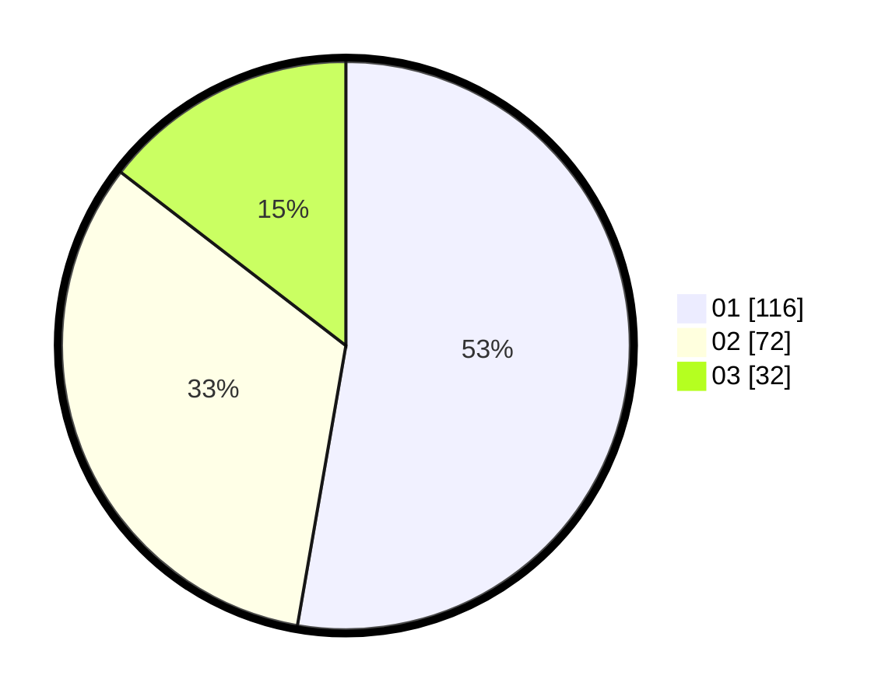

# Hasil

Hasil perolehan suara paslon dapat dilihat pada file paslon-01.txt, paslon-02.txt, dan paslon-03.txt.

Jika tidak ada, artinya data tersebut belum ada pada SIREKAP.

## Perolehan Suara

 * Paslon 01: **116**.
 * Paslon 02: **72**.
 * Paslon 03: **32**.

## Foto C Plano

https://sirekap-obj-formc.kpu.go.id/6403/pemilu/ppwp/31/75/07/10/04/3175071004042-20240215-003159--87ca6cf8-30b1-453f-8e63-5f026d0a17f5.jpg

https://sirekap-obj-formc.kpu.go.id/6403/pemilu/ppwp/31/75/07/10/04/3175071004042-20240215-003322--9a793926-d8c7-4a1c-ac75-382a0db93684.jpg

https://sirekap-obj-formc.kpu.go.id/6403/pemilu/ppwp/31/75/07/10/04/3175071004042-20240215-003605--7c608eea-8b04-4186-b11d-16b3504b6a75.jpg
