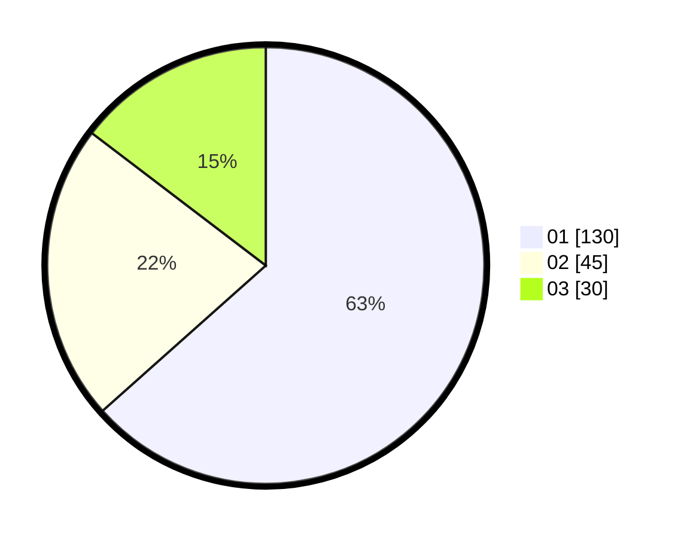

# Hasil

Hasil perolehan suara paslon dapat dilihat pada file paslon-01.txt, paslon-02.txt, dan paslon-03.txt.

Jika tidak ada, artinya data tersebut belum ada pada SIREKAP.

## Perolehan Suara

 * Paslon 01: **130**.
 * Paslon 02: **45**.
 * Paslon 03: **30**.

## Foto C Plano

https://sirekap-obj-formc.kpu.go.id/27f7/pemilu/ppwp/31/75/07/10/04/3175071004045-20240214-185920--d04723fd-d3ec-43b1-9b8a-81b2c2620567.jpg

https://sirekap-obj-formc.kpu.go.id/27f7/pemilu/ppwp/31/75/07/10/04/3175071004045-20240214-195359--668f32b9-58da-464f-b967-cee15027aa46.jpg

https://sirekap-obj-formc.kpu.go.id/27f7/pemilu/ppwp/31/75/07/10/04/3175071004045-20240214-190215--f4a3db37-2bc2-4a19-85b1-5bf401cfc696.jpg

## DATA PEMILIH TETAP

Jumlah pemilih dalam DPT: **244**.
 * L: **122**.
 * P: **122**.

## DATA PENGGUNA HAK PILIH

Jumlah pengguna hak pilih dalam DPT: **201**.
 * L: **96**.
 * P: **105**.

Jumlah pengguna hak pilih dalam DPTb: **2**.
 * L: **1**.
 * P: **1**.

Jumlah pengguna hak pilih dalam DPK: **2**.
 * L: **1**.
 * P: **1**.

Jumlah pengguna hak pilih: **205**.
 * L: **98**.
 * P: **107**.

## JUMLAH SUARA SAH DAN TIDAK SAH

JUMLAH SELURUH SUARA SAH: **205**.

JUMLAH SUARA TIDAK SAH: **0**.

JUMLAH SELURUH SUARA SAH DAN SUARA TIDAK SAH: **205**.
