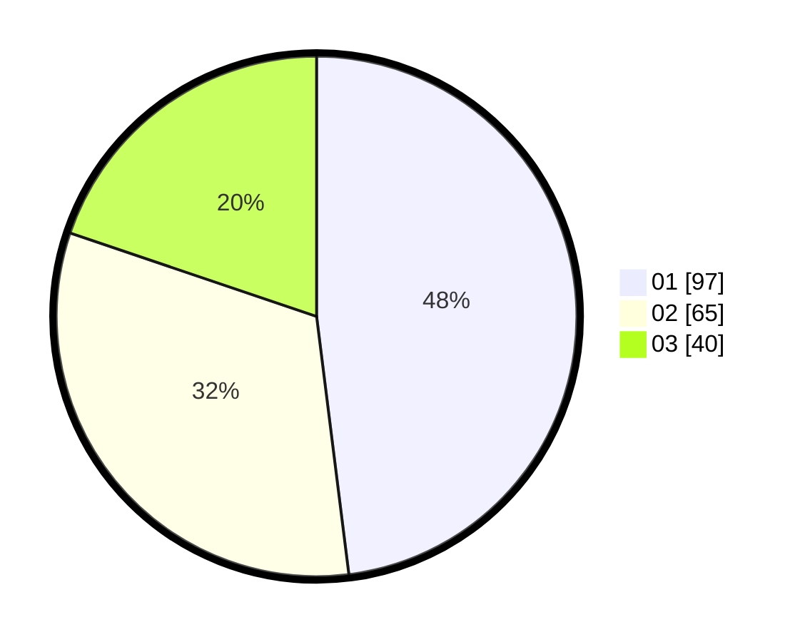

# Hasil

Hasil perolehan suara paslon dapat dilihat pada file paslon-01.txt, paslon-02.txt, dan paslon-03.txt.

Jika tidak ada, artinya data tersebut belum ada pada SIREKAP.

## Perolehan Suara

 * Paslon 01: **97**.
 * Paslon 02: **65**.
 * Paslon 03: **40**.

## Foto C Plano

https://sirekap-obj-formc.kpu.go.id/5a24/pemilu/ppwp/31/75/07/10/04/3175071004046-20240214-213100--9e5e6109-b75e-40ea-aaf9-a6f66eb302a3.jpg

https://sirekap-obj-formc.kpu.go.id/5a24/pemilu/ppwp/31/75/07/10/04/3175071004046-20240214-213210--053f70b9-9e2f-4b8b-93b9-13fbd3bcb48c.jpg

https://sirekap-obj-formc.kpu.go.id/5a24/pemilu/ppwp/31/75/07/10/04/3175071004046-20240214-213258--189fc5a1-37e8-4156-a3aa-cb1440a0aae6.jpg
