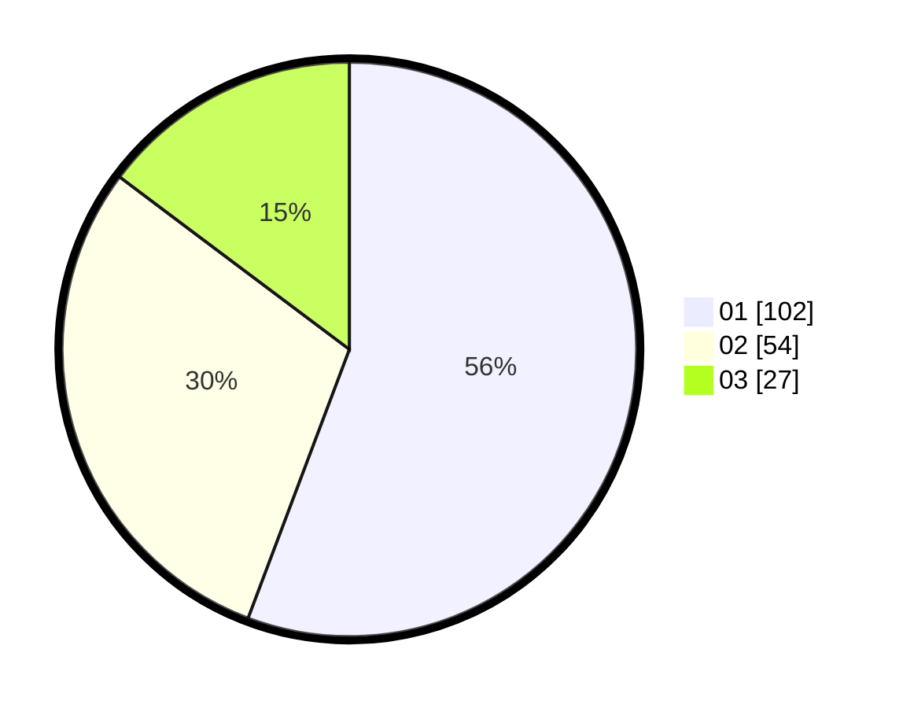

# Hasil

Hasil perolehan suara paslon dapat dilihat pada file paslon-01.txt, paslon-02.txt, dan paslon-03.txt.

Jika tidak ada, artinya data tersebut belum ada pada SIREKAP.

## Perolehan Suara

 * Paslon 01: **102**.
 * Paslon 02: **54**.
 * Paslon 03: **27**.

## Foto C Plano

https://sirekap-obj-formc.kpu.go.id/3ff8/pemilu/ppwp/31/75/07/10/04/3175071004047-20240214-210728--157ced53-d812-48e0-8bd8-2fd2381fc9b5.jpg

https://sirekap-obj-formc.kpu.go.id/3ff8/pemilu/ppwp/31/75/07/10/04/3175071004047-20240214-210828--b83ff7ed-d659-4854-b8a8-4e831ad55944.jpg

https://sirekap-obj-formc.kpu.go.id/3ff8/pemilu/ppwp/31/75/07/10/04/3175071004047-20240214-210912--afb94d93-c6e8-4b44-8e43-d6c1ac0585d1.jpg
