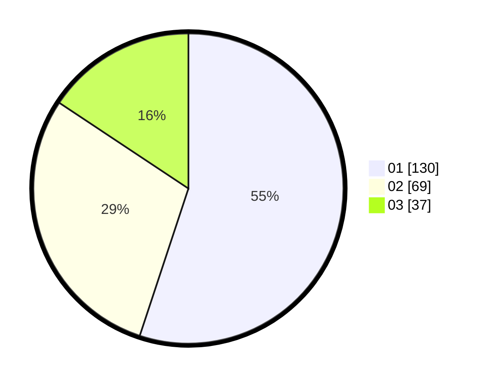

# Hasil

Hasil perolehan suara paslon dapat dilihat pada file paslon-01.txt, paslon-02.txt, dan paslon-03.txt.

Jika tidak ada, artinya data tersebut belum ada pada SIREKAP.

## Perolehan Suara

 * Paslon 01: **130**.
 * Paslon 02: **69**.
 * Paslon 03: **37**.

## Foto C Plano

https://sirekap-obj-formc.kpu.go.id/5ab6/pemilu/ppwp/31/75/07/10/04/3175071004048-20240216-150732--e0bf083a-1870-4218-812e-cdbd6e463393.jpg

https://sirekap-obj-formc.kpu.go.id/5ab6/pemilu/ppwp/31/75/07/10/04/3175071004048-20240216-150734--e79f03cc-2ed7-48fa-8d48-906f5a22de7c.jpg

https://sirekap-obj-formc.kpu.go.id/5ab6/pemilu/ppwp/31/75/07/10/04/3175071004048-20240216-150733--d5da372e-8eb1-44a4-99a5-f637e7595758.jpg

## DATA PEMILIH TETAP

Jumlah pemilih dalam DPT: **296**.
 * L: **140**.
 * P: **156**.

## DATA PENGGUNA HAK PILIH

Jumlah pengguna hak pilih dalam DPT: **236**.
 * L: **109**.
 * P: **127**.

Jumlah pengguna hak pilih dalam DPTb: **0**.
 * L: **0**.
 * P: **0**.

Jumlah pengguna hak pilih dalam DPK: **3**.
 * L: **0**.
 * P: **3**.

Jumlah pengguna hak pilih: **239**.
 * L: **109**.
 * P: **130**.

## JUMLAH SUARA SAH DAN TIDAK SAH

JUMLAH SELURUH SUARA SAH: **236**.

JUMLAH SUARA TIDAK SAH: **3**.

JUMLAH SELURUH SUARA SAH DAN SUARA TIDAK SAH: **239**.
