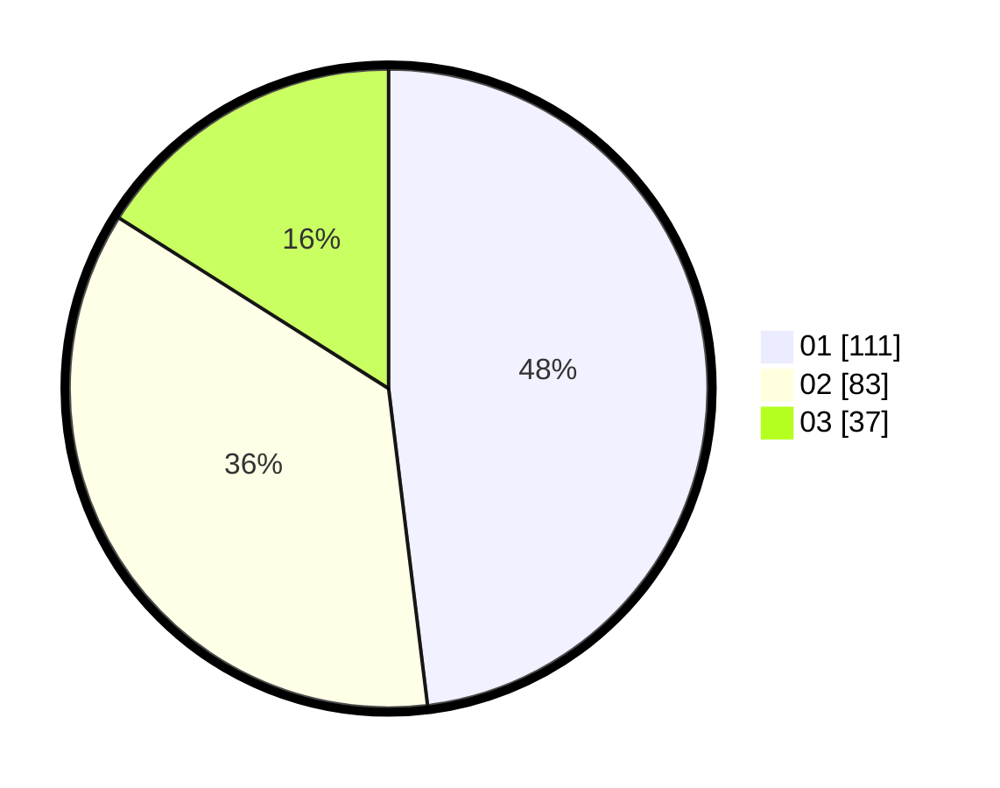

# Hasil

Hasil perolehan suara paslon dapat dilihat pada file paslon-01.txt, paslon-02.txt, dan paslon-03.txt.

Jika tidak ada, artinya data tersebut belum ada pada SIREKAP.

## Perolehan Suara

 * Paslon 01: **111**.
 * Paslon 02: **83**.
 * Paslon 03: **37**.

## Foto C Plano

https://sirekap-obj-formc.kpu.go.id/38db/pemilu/ppwp/31/75/07/10/04/3175071004054-20240214-192342--9065b638-8b4d-48e8-be36-c7043d9d2c03.jpg

https://sirekap-obj-formc.kpu.go.id/38db/pemilu/ppwp/31/75/07/10/04/3175071004054-20240214-192500--305f0c0f-99f3-4ab6-b3be-3db857620d69.jpg

https://sirekap-obj-formc.kpu.go.id/38db/pemilu/ppwp/31/75/07/10/04/3175071004054-20240214-192547--fb4a1295-a16f-4f0f-ae36-9db458a0d77e.jpg

## DATA PEMILIH TETAP

Jumlah pemilih dalam DPT: **267**.
 * L: **128**.
 * P: **139**.

## DATA PENGGUNA HAK PILIH

Jumlah pengguna hak pilih dalam DPT: **231**.
 * L: **107**.
 * P: **124**.

Jumlah pengguna hak pilih dalam DPTb: **4**.
 * L: **1**.
 * P: **3**.

Jumlah pengguna hak pilih dalam DPK: **2**.
 * L: **1**.
 * P: **1**.

Jumlah pengguna hak pilih: **237**.
 * L: **109**.
 * P: **128**.

## JUMLAH SUARA SAH DAN TIDAK SAH

JUMLAH SELURUH SUARA SAH: **231**.

JUMLAH SUARA TIDAK SAH: **6**.

JUMLAH SELURUH SUARA SAH DAN SUARA TIDAK SAH: **237**.
