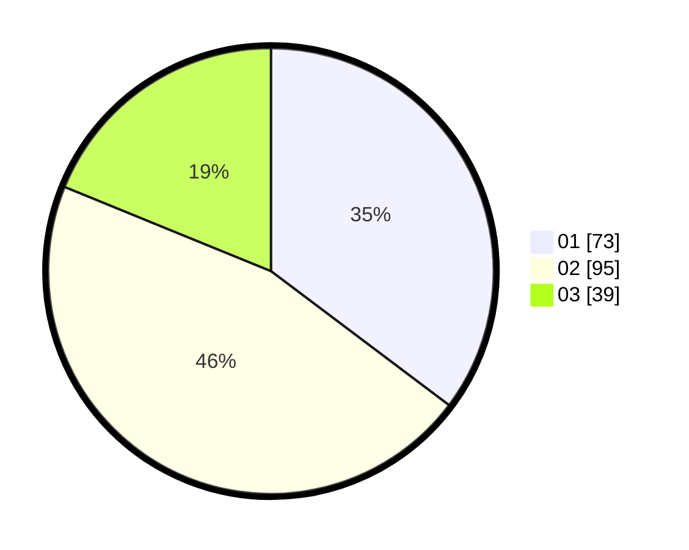

# Hasil

Hasil perolehan suara paslon dapat dilihat pada file paslon-01.txt, paslon-02.txt, dan paslon-03.txt.

Jika tidak ada, artinya data tersebut belum ada pada SIREKAP.

## Perolehan Suara

 * Paslon 01: **73**.
 * Paslon 02: **95**.
 * Paslon 03: **39**.

## Foto C Plano

https://sirekap-obj-formc.kpu.go.id/9be6/pemilu/ppwp/31/75/07/10/04/3175071004059-20240216-063507--88df5880-8bd6-4731-b884-60a9249ccb4f.jpg

https://sirekap-obj-formc.kpu.go.id/9be6/pemilu/ppwp/31/75/07/10/04/3175071004059-20240216-063512--d0891a50-bf1c-4c72-a437-9e23ed7c3717.jpg

https://sirekap-obj-formc.kpu.go.id/9be6/pemilu/ppwp/31/75/07/10/04/3175071004059-20240216-063510--1d1bbd76-bd5a-4e1b-8dd7-141b87ab2f30.jpg

## DATA PEMILIH TETAP

Jumlah pemilih dalam DPT: **272**.
 * L: **143**.
 * P: **129**.

## DATA PENGGUNA HAK PILIH

Jumlah pengguna hak pilih dalam DPT: **202**.
 * L: **97**.
 * P: **105**.

Jumlah pengguna hak pilih dalam DPTb: **3**.
 * L: **2**.
 * P: **1**.

Jumlah pengguna hak pilih dalam DPK: **6**.
 * L: **3**.
 * P: **3**.

Jumlah pengguna hak pilih: **211**.
 * L: **102**.
 * P: **109**.

## JUMLAH SUARA SAH DAN TIDAK SAH

JUMLAH SELURUH SUARA SAH: **207**.

JUMLAH SUARA TIDAK SAH: **5**.

JUMLAH SELURUH SUARA SAH DAN SUARA TIDAK SAH: **212**.
