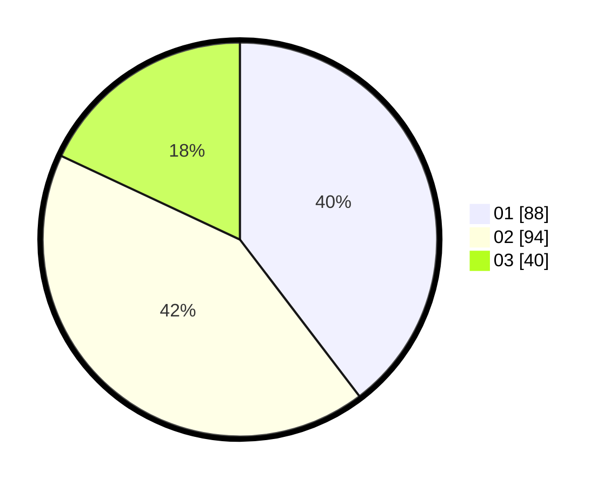

# Hasil

Hasil perolehan suara paslon dapat dilihat pada file paslon-01.txt, paslon-02.txt, dan paslon-03.txt.

Jika tidak ada, artinya data tersebut belum ada pada SIREKAP.

## Perolehan Suara

 * Paslon 01: **88**.
 * Paslon 02: **94**.
 * Paslon 03: **40**.

## Foto C Plano

https://sirekap-obj-formc.kpu.go.id/67d5/pemilu/ppwp/31/75/07/10/04/3175071004063-20240215-205539--b5ac83a9-b9d3-4886-ba04-5476d88f343d.jpg

https://sirekap-obj-formc.kpu.go.id/67d5/pemilu/ppwp/31/75/07/10/04/3175071004063-20240215-205541--dfc781c7-ae3b-4a09-8949-863b842bcce0.jpg

https://sirekap-obj-formc.kpu.go.id/67d5/pemilu/ppwp/31/75/07/10/04/3175071004063-20240215-205540--66183b8d-fa93-4715-aa5d-146c1634d197.jpg

## DATA PEMILIH TETAP

Jumlah pemilih dalam DPT: **286**.
 * L: **146**.
 * P: **140**.

## DATA PENGGUNA HAK PILIH

Jumlah pengguna hak pilih dalam DPT: **220**.
 * L: **107**.
 * P: **113**.

Jumlah pengguna hak pilih dalam DPTb: **0**.
 * L: **0**.
 * P: **0**.

Jumlah pengguna hak pilih dalam DPK: **3**.
 * L: **0**.
 * P: **3**.

Jumlah pengguna hak pilih: **223**.
 * L: **107**.
 * P: **116**.

## JUMLAH SUARA SAH DAN TIDAK SAH

JUMLAH SELURUH SUARA SAH: **222**.

JUMLAH SUARA TIDAK SAH: **1**.

JUMLAH SELURUH SUARA SAH DAN SUARA TIDAK SAH: **223**.
