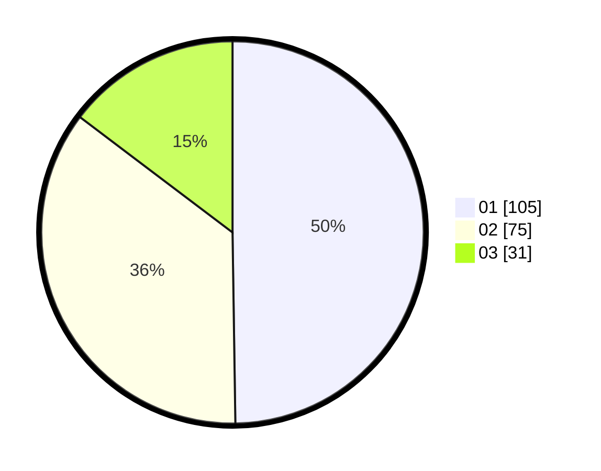

# Hasil

Hasil perolehan suara paslon dapat dilihat pada file paslon-01.txt, paslon-02.txt, dan paslon-03.txt.

Jika tidak ada, artinya data tersebut belum ada pada SIREKAP.

## Perolehan Suara

 * Paslon 01: **105**.
 * Paslon 02: **75**.
 * Paslon 03: **31**.

## Foto C Plano

https://sirekap-obj-formc.kpu.go.id/790e/pemilu/ppwp/31/75/07/10/04/3175071004075-20240214-192821--8e61da69-824d-4763-b8c9-dd3814162ef5.jpg

https://sirekap-obj-formc.kpu.go.id/790e/pemilu/ppwp/31/75/07/10/04/3175071004075-20240214-201708--8b2e0844-3cca-4dfa-9278-391199011c3b.jpg

https://sirekap-obj-formc.kpu.go.id/790e/pemilu/ppwp/31/75/07/10/04/3175071004075-20240214-193411--8de2f978-29e2-4178-a2b5-833790482409.jpg

## DATA PEMILIH TETAP

Jumlah pemilih dalam DPT: **270**.
 * L: **136**.
 * P: **134**.

## DATA PENGGUNA HAK PILIH

Jumlah pengguna hak pilih dalam DPT: **212**.
 * L: **105**.
 * P: **107**.

Jumlah pengguna hak pilih dalam DPTb: **0**.
 * L: **0**.
 * P: **0**.

Jumlah pengguna hak pilih dalam DPK: **1**.
 * L: **0**.
 * P: **1**.

Jumlah pengguna hak pilih: **213**.
 * L: **105**.
 * P: **108**.

## JUMLAH SUARA SAH DAN TIDAK SAH

JUMLAH SELURUH SUARA SAH: **211**.

JUMLAH SUARA TIDAK SAH: **2**.

JUMLAH SELURUH SUARA SAH DAN SUARA TIDAK SAH: **213**.
