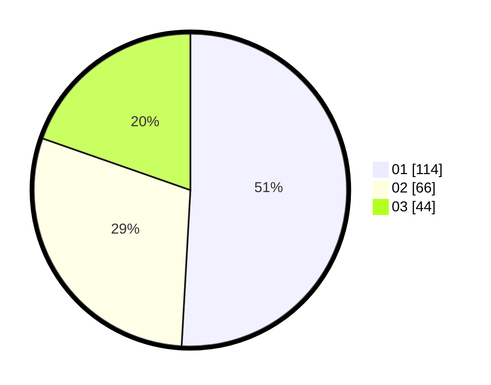

# Hasil

Hasil perolehan suara paslon dapat dilihat pada file paslon-01.txt, paslon-02.txt, dan paslon-03.txt.

Jika tidak ada, artinya data tersebut belum ada pada SIREKAP.

## Perolehan Suara

 * Paslon 01: **114**.
 * Paslon 02: **66**.
 * Paslon 03: **44**.

## Foto C Plano

https://sirekap-obj-formc.kpu.go.id/515a/pemilu/ppwp/31/75/07/10/04/3175071004076-20240214-190621--273b9edc-5da4-4c04-8df1-5260afd04177.jpg

https://sirekap-obj-formc.kpu.go.id/515a/pemilu/ppwp/31/75/07/10/04/3175071004076-20240214-191040--cb7a9707-b938-4bdd-8ea4-4c8e69cbde9a.jpg

https://sirekap-obj-formc.kpu.go.id/515a/pemilu/ppwp/31/75/07/10/04/3175071004076-20240214-191139--9d8b918e-1ba1-4a97-a975-d3076aeadc96.jpg

## DATA PEMILIH TETAP

Jumlah pemilih dalam DPT: **263**.
 * L: **121**.
 * P: **141**.

## DATA PENGGUNA HAK PILIH

Jumlah pengguna hak pilih dalam DPT: **217**.
 * L: **116**.
 * P: **101**.

Jumlah pengguna hak pilih dalam DPTb: **1**.
 * L: **1**.
 * P: **0**.

Jumlah pengguna hak pilih dalam DPK: **8**.
 * L: **2**.
 * P: **6**.

Jumlah pengguna hak pilih: **226**.
 * L: **119**.
 * P: **107**.

## JUMLAH SUARA SAH DAN TIDAK SAH

JUMLAH SELURUH SUARA SAH: **224**.

JUMLAH SUARA TIDAK SAH: **2**.

JUMLAH SELURUH SUARA SAH DAN SUARA TIDAK SAH: **226**.
