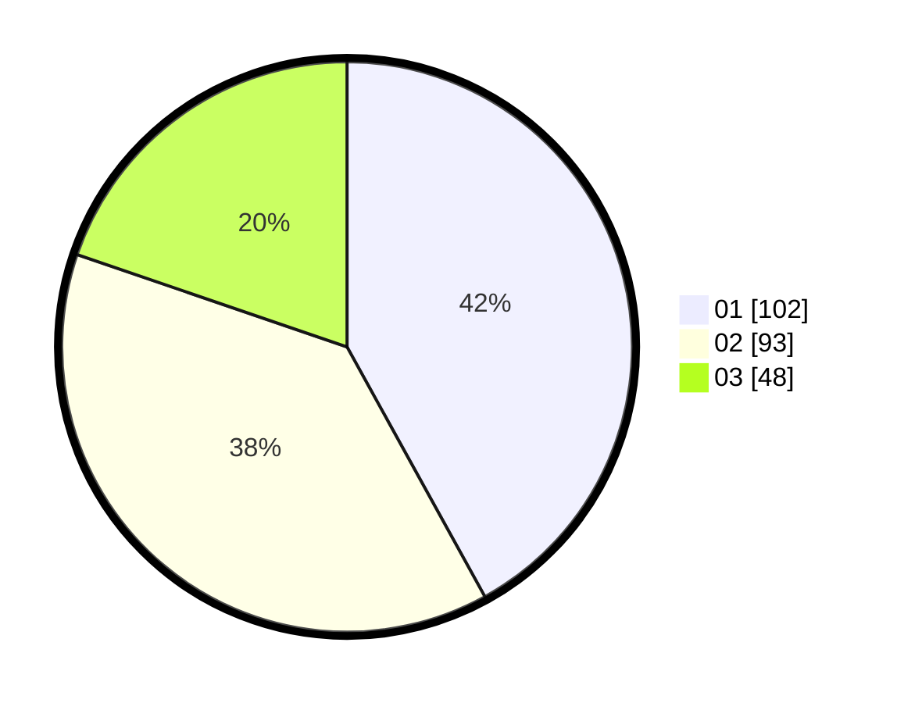

# Hasil

Hasil perolehan suara paslon dapat dilihat pada file paslon-01.txt, paslon-02.txt, dan paslon-03.txt.

Jika tidak ada, artinya data tersebut belum ada pada SIREKAP.

## Perolehan Suara

 * Paslon 01: **102**.
 * Paslon 02: **93**.
 * Paslon 03: **48**.

## Foto C Plano

https://sirekap-obj-formc.kpu.go.id/554e/pemilu/ppwp/31/75/07/10/04/3175071004081-20240214-162216--4b8bede3-8678-4a9c-a625-5a22007e163e.jpg

https://sirekap-obj-formc.kpu.go.id/554e/pemilu/ppwp/31/75/07/10/04/3175071004081-20240214-155755--69f9228c-99d6-42be-bd83-3f6f3b57d148.jpg

https://sirekap-obj-formc.kpu.go.id/554e/pemilu/ppwp/31/75/07/10/04/3175071004081-20240214-185533--8e840489-1d7c-4319-9c7e-aeab330520bf.jpg

## DATA PEMILIH TETAP

Jumlah pemilih dalam DPT: **300**.
 * L: **135**.
 * P: **165**.

## DATA PENGGUNA HAK PILIH

Jumlah pengguna hak pilih dalam DPT: **242**.
 * L: **106**.
 * P: **136**.

Jumlah pengguna hak pilih dalam DPTb: **2**.
 * L: **1**.
 * P: **1**.

Jumlah pengguna hak pilih dalam DPK: **0**.
 * L: **0**.
 * P: **0**.

Jumlah pengguna hak pilih: **244**.
 * L: **107**.
 * P: **137**.

## JUMLAH SUARA SAH DAN TIDAK SAH

JUMLAH SELURUH SUARA SAH: **243**.

JUMLAH SUARA TIDAK SAH: **1**.

JUMLAH SELURUH SUARA SAH DAN SUARA TIDAK SAH: **244**.
