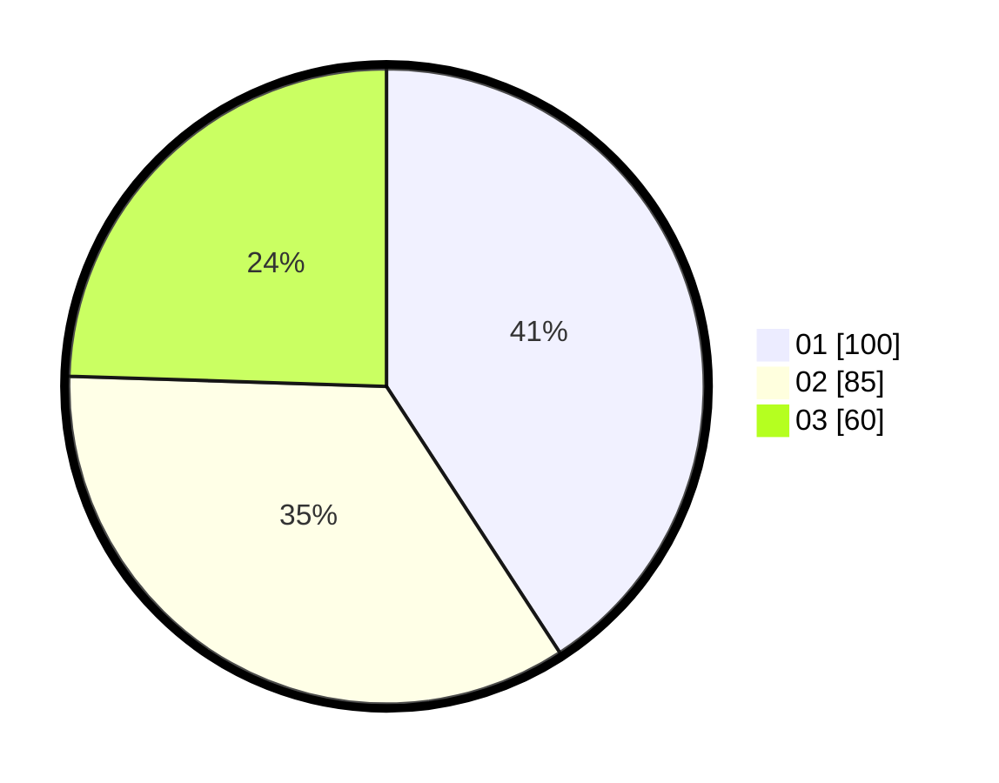

# Hasil

Hasil perolehan suara paslon dapat dilihat pada file paslon-01.txt, paslon-02.txt, dan paslon-03.txt.

Jika tidak ada, artinya data tersebut belum ada pada SIREKAP.

## Perolehan Suara

 * Paslon 01: **100**.
 * Paslon 02: **85**.
 * Paslon 03: **60**.

## Foto C Plano

https://sirekap-obj-formc.kpu.go.id/d352/pemilu/ppwp/31/75/07/10/04/3175071004082-20240216-131150--1c012549-0737-4a15-b40f-d0825a8d1456.jpg

https://sirekap-obj-formc.kpu.go.id/d352/pemilu/ppwp/31/75/07/10/04/3175071004082-20240214-155046--3a5e754f-1553-4f3b-8e66-5e08d408229b.jpg

https://sirekap-obj-formc.kpu.go.id/d352/pemilu/ppwp/31/75/07/10/04/3175071004082-20240216-131151--2b218d05-f6ee-4ee8-9f3b-f446a21fa172.jpg

## DATA PEMILIH TETAP

Jumlah pemilih dalam DPT: **295**.
 * L: **138**.
 * P: **157**.

## DATA PENGGUNA HAK PILIH

Jumlah pengguna hak pilih dalam DPT: **247**.
 * L: **113**.
 * P: **134**.

Jumlah pengguna hak pilih dalam DPTb: **0**.
 * L: **0**.
 * P: **0**.

Jumlah pengguna hak pilih dalam DPK: **4**.
 * L: **3**.
 * P: **1**.

Jumlah pengguna hak pilih: **251**.
 * L: **0**.
 * P: **0**.

## JUMLAH SUARA SAH DAN TIDAK SAH

JUMLAH SELURUH SUARA SAH: **245**.

JUMLAH SUARA TIDAK SAH: **6**.

JUMLAH SELURUH SUARA SAH DAN SUARA TIDAK SAH: **251**.
