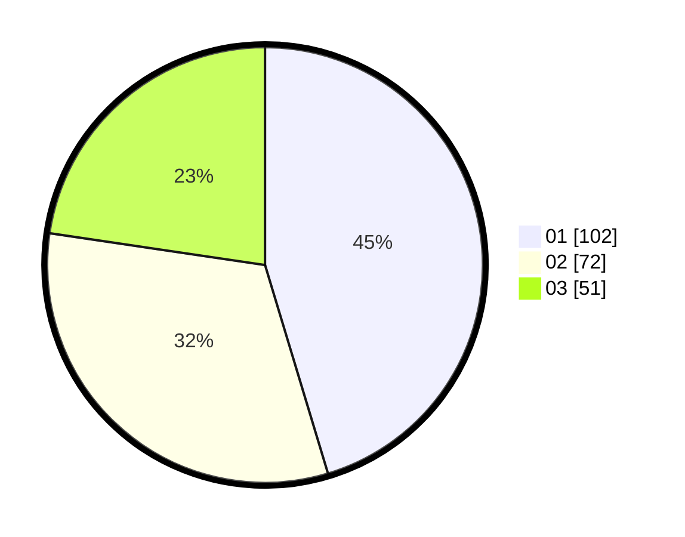

# Hasil

Hasil perolehan suara paslon dapat dilihat pada file paslon-01.txt, paslon-02.txt, dan paslon-03.txt.

Jika tidak ada, artinya data tersebut belum ada pada SIREKAP.

## Perolehan Suara

 * Paslon 01: **102**.
 * Paslon 02: **72**.
 * Paslon 03: **51**.

## Foto C Plano

https://sirekap-obj-formc.kpu.go.id/8bc5/pemilu/ppwp/31/75/07/10/04/3175071004084-20240214-184841--4d313779-42ff-43ee-865f-1d679c5ac2ad.jpg

https://sirekap-obj-formc.kpu.go.id/8bc5/pemilu/ppwp/31/75/07/10/04/3175071004084-20240214-190848--f6220726-f3c1-4349-bac2-aac259c24e50.jpg

https://sirekap-obj-formc.kpu.go.id/8bc5/pemilu/ppwp/31/75/07/10/04/3175071004084-20240214-185353--8aa79dc4-3f87-4cc8-8d0a-ca783bba5d76.jpg

## DATA PEMILIH TETAP

Jumlah pemilih dalam DPT: **272**.
 * L: **127**.
 * P: **145**.

## DATA PENGGUNA HAK PILIH

Jumlah pengguna hak pilih dalam DPT: **224**.
 * L: **99**.
 * P: **125**.

Jumlah pengguna hak pilih dalam DPTb: **0**.
 * L: **0**.
 * P: **0**.

Jumlah pengguna hak pilih dalam DPK: **4**.
 * L: **1**.
 * P: **3**.

Jumlah pengguna hak pilih: **228**.
 * L: **100**.
 * P: **128**.

## JUMLAH SUARA SAH DAN TIDAK SAH

JUMLAH SELURUH SUARA SAH: **225**.

JUMLAH SUARA TIDAK SAH: **3**.

JUMLAH SELURUH SUARA SAH DAN SUARA TIDAK SAH: **228**.
