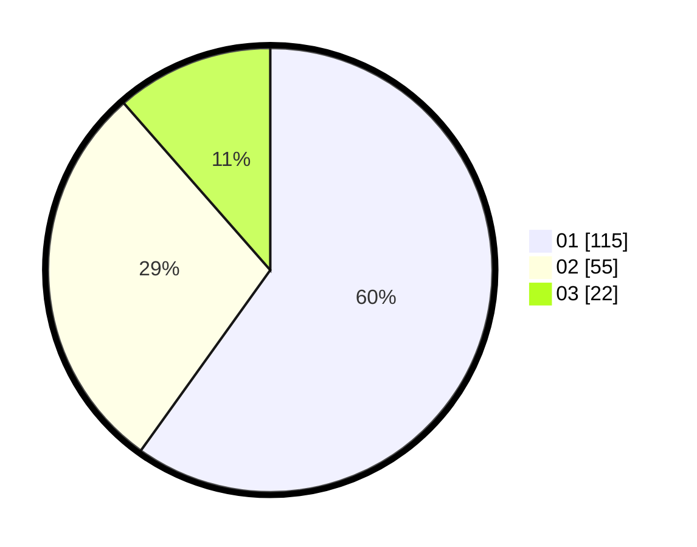

# Hasil

Hasil perolehan suara paslon dapat dilihat pada file paslon-01.txt, paslon-02.txt, dan paslon-03.txt.

Jika tidak ada, artinya data tersebut belum ada pada SIREKAP.

## Perolehan Suara

 * Paslon 01: **115**.
 * Paslon 02: **55**.
 * Paslon 03: **22**.

## Foto C Plano

https://sirekap-obj-formc.kpu.go.id/49e3/pemilu/ppwp/31/75/07/10/04/3175071004096-20240214-212339--5becc7c4-2416-4882-83e7-dd57e436b46c.jpg

https://sirekap-obj-formc.kpu.go.id/49e3/pemilu/ppwp/31/75/07/10/04/3175071004096-20240214-221146--d6a95c9c-58ba-4429-ac8e-c312cdc24cda.jpg

https://sirekap-obj-formc.kpu.go.id/49e3/pemilu/ppwp/31/75/07/10/04/3175071004096-20240214-221310--143b3d2e-a30e-4148-b6eb-7d4b32c7c6c3.jpg

## DATA PEMILIH TETAP

Jumlah pemilih dalam DPT: **251**.
 * L: **112**.
 * P: **139**.

## DATA PENGGUNA HAK PILIH

Jumlah pengguna hak pilih dalam DPT: **204**.
 * L: **87**.
 * P: **117**.

Jumlah pengguna hak pilih dalam DPTb: **1**.
 * L: **0**.
 * P: **1**.

Jumlah pengguna hak pilih dalam DPK: **0**.
 * L: **0**.
 * P: **0**.

Jumlah pengguna hak pilih: **205**.
 * L: **87**.
 * P: **118**.

## JUMLAH SUARA SAH DAN TIDAK SAH

JUMLAH SELURUH SUARA SAH: **202**.

JUMLAH SUARA TIDAK SAH: **3**.

JUMLAH SELURUH SUARA SAH DAN SUARA TIDAK SAH: **205**.
