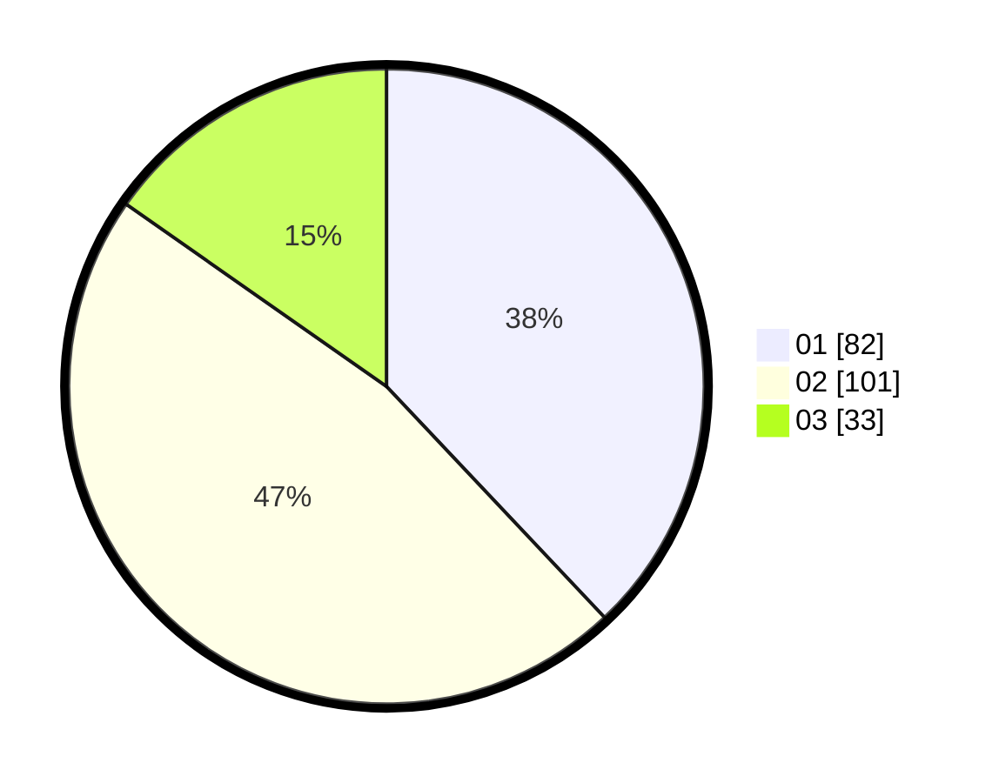

# Hasil

Hasil perolehan suara paslon dapat dilihat pada file paslon-01.txt, paslon-02.txt, dan paslon-03.txt.

Jika tidak ada, artinya data tersebut belum ada pada SIREKAP.

## Perolehan Suara

 * Paslon 01: **82**.
 * Paslon 02: **101**.
 * Paslon 03: **33**.

## Foto C Plano

https://sirekap-obj-formc.kpu.go.id/f701/pemilu/ppwp/31/75/07/10/04/3175071004101-20240214-231754--6e2a44a5-d525-4015-b884-abb81bfecf2d.jpg

https://sirekap-obj-formc.kpu.go.id/f701/pemilu/ppwp/31/75/07/10/04/3175071004101-20240214-231933--4f6538fa-8906-48a5-aac8-4d37d3ea8020.jpg

https://sirekap-obj-formc.kpu.go.id/f701/pemilu/ppwp/31/75/07/10/04/3175071004101-20240214-232010--ba81c759-9f18-489a-a6ad-15fedce157e6.jpg
