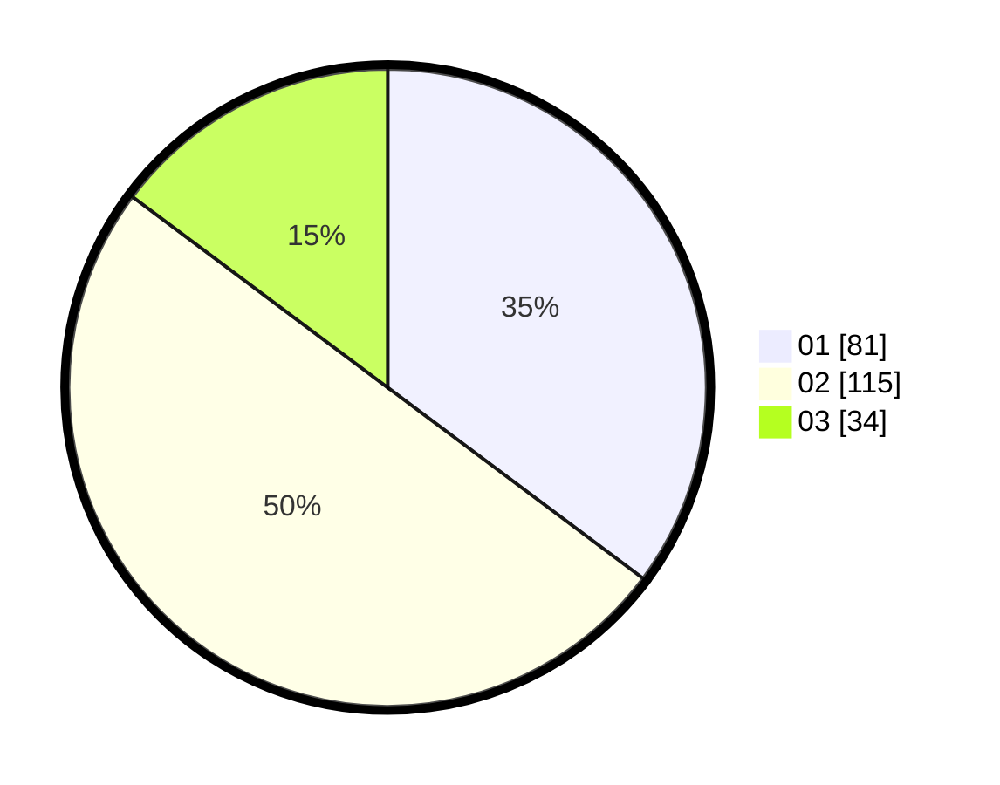

# Hasil

Hasil perolehan suara paslon dapat dilihat pada file paslon-01.txt, paslon-02.txt, dan paslon-03.txt.

Jika tidak ada, artinya data tersebut belum ada pada SIREKAP.

## Perolehan Suara

 * Paslon 01: **81**.
 * Paslon 02: **115**.
 * Paslon 03: **34**.

## Foto C Plano

https://sirekap-obj-formc.kpu.go.id/d3e7/pemilu/ppwp/31/75/07/10/04/3175071004104-20240216-132029--d7a9578f-4561-4b43-83ea-5d87093eca17.jpg

https://sirekap-obj-formc.kpu.go.id/d3e7/pemilu/ppwp/31/75/07/10/04/3175071004104-20240216-132030--8d6ddfe7-a0ba-46ee-9e25-d8c82a0443e9.jpg

https://sirekap-obj-formc.kpu.go.id/d3e7/pemilu/ppwp/31/75/07/10/04/3175071004104-20240216-132030--8a5c6e3a-0309-48fd-a58f-1196967462a9.jpg

## DATA PEMILIH TETAP

Jumlah pemilih dalam DPT: **291**.
 * L: **134**.
 * P: **157**.

## DATA PENGGUNA HAK PILIH

Jumlah pengguna hak pilih dalam DPT: **219**.
 * L: **90**.
 * P: **129**.

Jumlah pengguna hak pilih dalam DPTb: **7**.
 * L: **4**.
 * P: **3**.

Jumlah pengguna hak pilih dalam DPK: **7**.
 * L: **2**.
 * P: **5**.

Jumlah pengguna hak pilih: **233**.
 * L: **96**.
 * P: **137**.

## JUMLAH SUARA SAH DAN TIDAK SAH

JUMLAH SELURUH SUARA SAH: **230**.

JUMLAH SUARA TIDAK SAH: **3**.

JUMLAH SELURUH SUARA SAH DAN SUARA TIDAK SAH: **233**.
