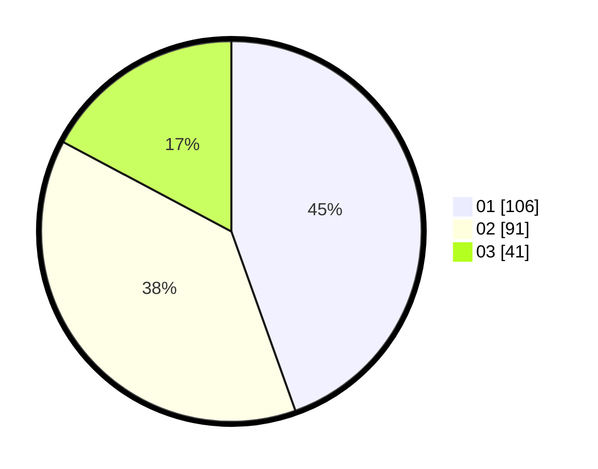

# Hasil

Hasil perolehan suara paslon dapat dilihat pada file paslon-01.txt, paslon-02.txt, dan paslon-03.txt.

Jika tidak ada, artinya data tersebut belum ada pada SIREKAP.

## Perolehan Suara

 * Paslon 01: **106**.
 * Paslon 02: **91**.
 * Paslon 03: **41**.

## Foto C Plano

https://sirekap-obj-formc.kpu.go.id/1478/pemilu/ppwp/31/75/07/10/04/3175071004107-20240214-220816--72a030c0-3ff7-41aa-9681-82a430bbfa1c.jpg

https://sirekap-obj-formc.kpu.go.id/1478/pemilu/ppwp/31/75/07/10/04/3175071004107-20240214-220921--64606395-dbf7-4f37-b5b4-dc0542ec4ba1.jpg

https://sirekap-obj-formc.kpu.go.id/1478/pemilu/ppwp/31/75/07/10/04/3175071004107-20240214-221013--6dfd4aaa-702d-4853-bcda-f04a58f49d87.jpg
