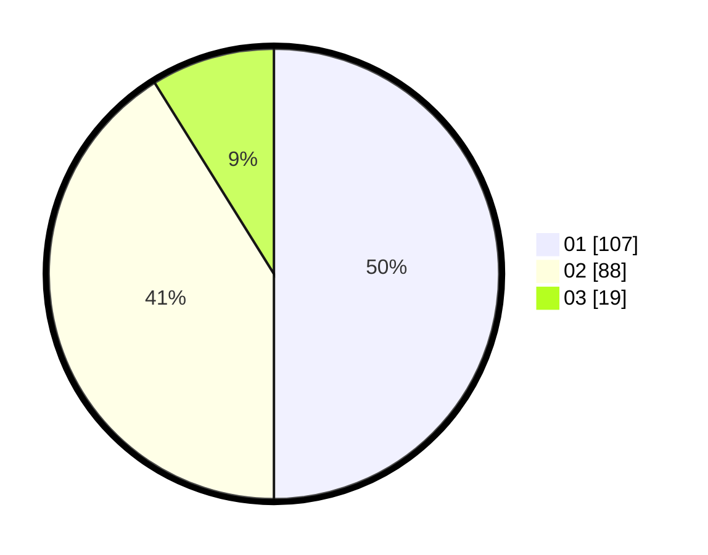

# Hasil

Hasil perolehan suara paslon dapat dilihat pada file paslon-01.txt, paslon-02.txt, dan paslon-03.txt.

Jika tidak ada, artinya data tersebut belum ada pada SIREKAP.

## Perolehan Suara

 * Paslon 01: **107**.
 * Paslon 02: **88**.
 * Paslon 03: **19**.

## Foto C Plano

https://sirekap-obj-formc.kpu.go.id/9b05/pemilu/ppwp/31/75/07/10/04/3175071004114-20240214-200052--e6e85c6c-9560-401f-b398-0479f1ee66f9.jpg

https://sirekap-obj-formc.kpu.go.id/9b05/pemilu/ppwp/31/75/07/10/04/3175071004114-20240214-200207--723bddc2-77ca-4869-81de-f7fe6fbb52fb.jpg

https://sirekap-obj-formc.kpu.go.id/9b05/pemilu/ppwp/31/75/07/10/04/3175071004114-20240214-200336--406106d2-bda9-4f27-b075-70b21ad16b55.jpg

## DATA PEMILIH TETAP

Jumlah pemilih dalam DPT: **257**.
 * L: **136**.
 * P: **121**.

## DATA PENGGUNA HAK PILIH

Jumlah pengguna hak pilih dalam DPT: **210**.
 * L: **109**.
 * P: **101**.

Jumlah pengguna hak pilih dalam DPTb: **0**.
 * L: **0**.
 * P: **0**.

Jumlah pengguna hak pilih dalam DPK: **14**.
 * L: **8**.
 * P: **6**.

Jumlah pengguna hak pilih: **224**.
 * L: **117**.
 * P: **107**.

## JUMLAH SUARA SAH DAN TIDAK SAH

JUMLAH SELURUH SUARA SAH: **214**.

JUMLAH SUARA TIDAK SAH: **10**.

JUMLAH SELURUH SUARA SAH DAN SUARA TIDAK SAH: **224**.
