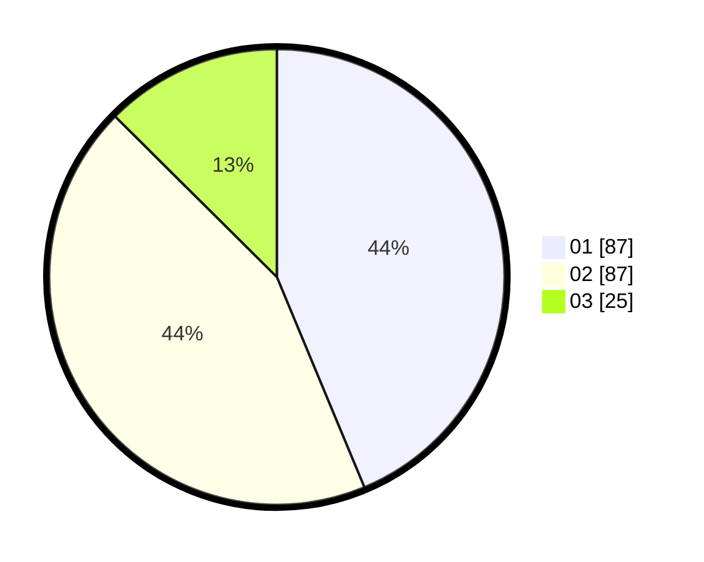

# Hasil

Hasil perolehan suara paslon dapat dilihat pada file paslon-01.txt, paslon-02.txt, dan paslon-03.txt.

Jika tidak ada, artinya data tersebut belum ada pada SIREKAP.

## Perolehan Suara

 * Paslon 01: **87**.
 * Paslon 02: **87**.
 * Paslon 03: **25**.

## Foto C Plano

https://sirekap-obj-formc.kpu.go.id/b72c/pemilu/ppwp/31/75/07/10/04/3175071004117-20240214-232825--317addec-50ef-4099-849d-a672bc22a791.jpg

https://sirekap-obj-formc.kpu.go.id/b72c/pemilu/ppwp/31/75/07/10/04/3175071004117-20240214-232835--8c62bba2-12fb-423c-bdfb-8820dd45afd1.jpg

https://sirekap-obj-formc.kpu.go.id/b72c/pemilu/ppwp/31/75/07/10/04/3175071004117-20240214-232833--fa79eacb-e735-43f9-8100-dd74136c5ec9.jpg
