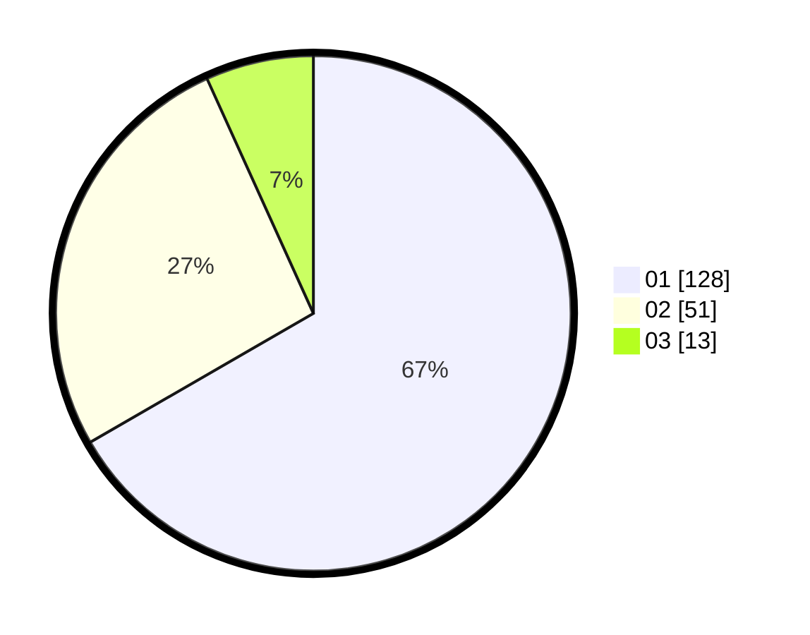

# Hasil

Hasil perolehan suara paslon dapat dilihat pada file paslon-01.txt, paslon-02.txt, dan paslon-03.txt.

Jika tidak ada, artinya data tersebut belum ada pada SIREKAP.

## Perolehan Suara

 * Paslon 01: **128**.
 * Paslon 02: **51**.
 * Paslon 03: **13**.

## Foto C Plano

https://sirekap-obj-formc.kpu.go.id/b15e/pemilu/ppwp/31/75/07/10/04/3175071004121-20240214-221923--ddf32fc1-c77e-4422-95ab-6b6d244e6871.jpg

https://sirekap-obj-formc.kpu.go.id/b15e/pemilu/ppwp/31/75/07/10/04/3175071004121-20240214-201306--336e305b-f86b-4c8b-ab90-223d6a0d8ddc.jpg

https://sirekap-obj-formc.kpu.go.id/b15e/pemilu/ppwp/31/75/07/10/04/3175071004121-20240214-201346--511820f0-7d02-4612-87a3-c307d9d04955.jpg
