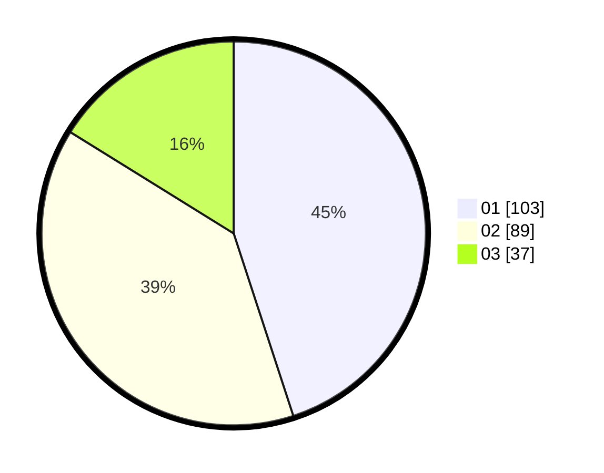

# Hasil

Hasil perolehan suara paslon dapat dilihat pada file paslon-01.txt, paslon-02.txt, dan paslon-03.txt.

Jika tidak ada, artinya data tersebut belum ada pada SIREKAP.

## Perolehan Suara

 * Paslon 01: **103**.
 * Paslon 02: **89**.
 * Paslon 03: **37**.

## Foto C Plano

https://sirekap-obj-formc.kpu.go.id/b127/pemilu/ppwp/31/75/07/10/04/3175071004123-20240214-185125--8df3f881-5b79-46c1-82ae-50fdb879554f.jpg

https://sirekap-obj-formc.kpu.go.id/b127/pemilu/ppwp/31/75/07/10/04/3175071004123-20240216-142629--9e4ad9f7-9c51-4709-bccc-e6f1e265fbbb.jpg

https://sirekap-obj-formc.kpu.go.id/b127/pemilu/ppwp/31/75/07/10/04/3175071004123-20240214-192849--b53d9c70-2c8c-40b3-af44-eadc468bb449.jpg

## DATA PEMILIH TETAP

Jumlah pemilih dalam DPT: **274**.
 * L: **144**.
 * P: **130**.

## DATA PENGGUNA HAK PILIH

Jumlah pengguna hak pilih dalam DPT: **226**.
 * L: **116**.
 * P: **110**.

Jumlah pengguna hak pilih dalam DPTb: **0**.
 * L: **0**.
 * P: **0**.

Jumlah pengguna hak pilih dalam DPK: **4**.
 * L: **1**.
 * P: **3**.

Jumlah pengguna hak pilih: **230**.
 * L: **117**.
 * P: **113**.

## JUMLAH SUARA SAH DAN TIDAK SAH

JUMLAH SELURUH SUARA SAH: **229**.

JUMLAH SUARA TIDAK SAH: **1**.

JUMLAH SELURUH SUARA SAH DAN SUARA TIDAK SAH: **230**.
