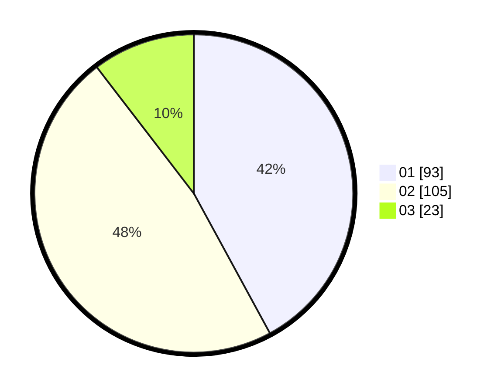

# Hasil

Hasil perolehan suara paslon dapat dilihat pada file paslon-01.txt, paslon-02.txt, dan paslon-03.txt.

Jika tidak ada, artinya data tersebut belum ada pada SIREKAP.

## Perolehan Suara

 * Paslon 01: **93**.
 * Paslon 02: **105**.
 * Paslon 03: **23**.

## Foto C Plano

https://sirekap-obj-formc.kpu.go.id/6f8f/pemilu/ppwp/31/75/07/10/04/3175071004128-20240215-002002--b990dfe6-8913-4eac-920d-22a271c3eeb7.jpg

https://sirekap-obj-formc.kpu.go.id/6f8f/pemilu/ppwp/31/75/07/10/04/3175071004128-20240214-235738--63e84453-4d3e-48ed-9448-edd7899045aa.jpg

https://sirekap-obj-formc.kpu.go.id/6f8f/pemilu/ppwp/31/75/07/10/04/3175071004128-20240214-235843--5f09acf2-9c62-4fa9-a4ea-2bf444a2b413.jpg
