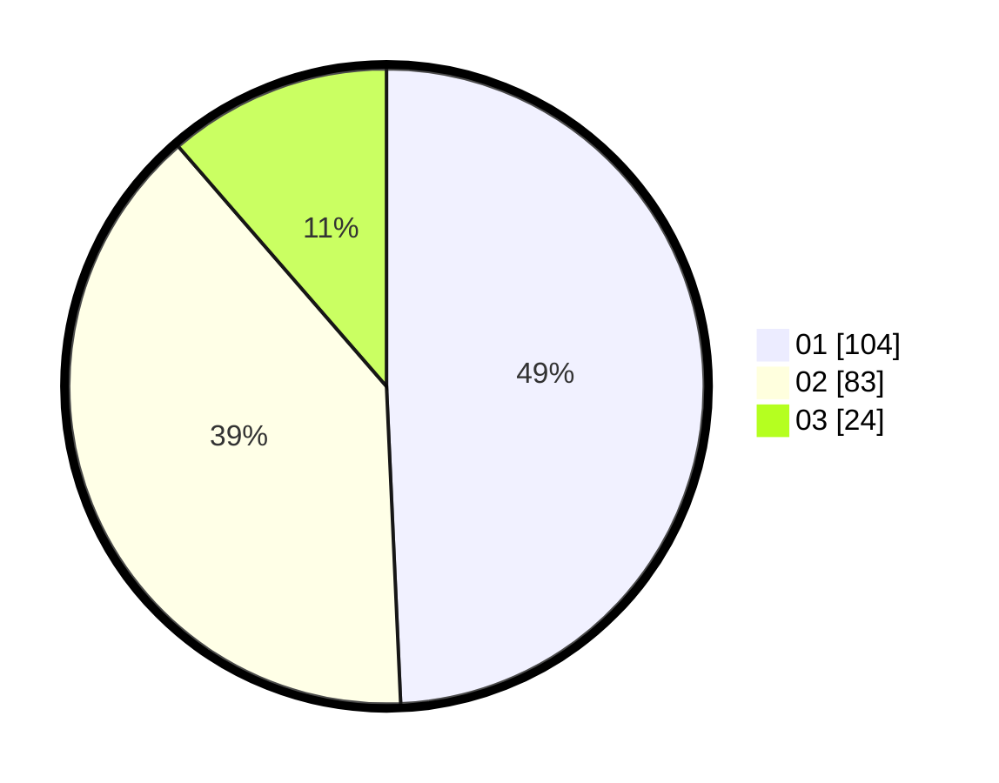

# Hasil

Hasil perolehan suara paslon dapat dilihat pada file paslon-01.txt, paslon-02.txt, dan paslon-03.txt.

Jika tidak ada, artinya data tersebut belum ada pada SIREKAP.

## Perolehan Suara

 * Paslon 01: **104**.
 * Paslon 02: **83**.
 * Paslon 03: **24**.

## Foto C Plano

https://sirekap-obj-formc.kpu.go.id/0cda/pemilu/ppwp/31/75/07/10/04/3175071004129-20240214-235301--da34b0e2-22e5-49e8-863d-adbddb04388c.jpg

https://sirekap-obj-formc.kpu.go.id/0cda/pemilu/ppwp/31/75/07/10/04/3175071004129-20240214-235523--ed54af98-0871-43f8-9443-872933d7bef3.jpg
