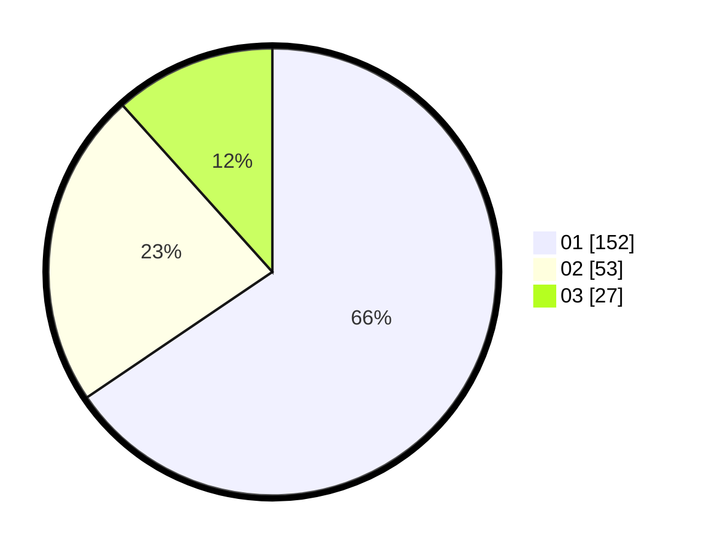

# Hasil

Hasil perolehan suara paslon dapat dilihat pada file paslon-01.txt, paslon-02.txt, dan paslon-03.txt.

Jika tidak ada, artinya data tersebut belum ada pada SIREKAP.

## Perolehan Suara

 * Paslon 01: **152**.
 * Paslon 02: **53**.
 * Paslon 03: **27**.

## Foto C Plano

https://sirekap-obj-formc.kpu.go.id/360d/pemilu/ppwp/31/75/07/10/04/3175071004130-20240215-010621--9f3f679d-b3fc-4835-9f80-fbfc18f7b09b.jpg

https://sirekap-obj-formc.kpu.go.id/360d/pemilu/ppwp/31/75/07/10/04/3175071004130-20240215-010909--85597df5-6f65-432b-9f63-516d00334277.jpg

https://sirekap-obj-formc.kpu.go.id/360d/pemilu/ppwp/31/75/07/10/04/3175071004130-20240215-011130--e4fec194-ed6e-4f09-a41b-5515df0e31cb.jpg
