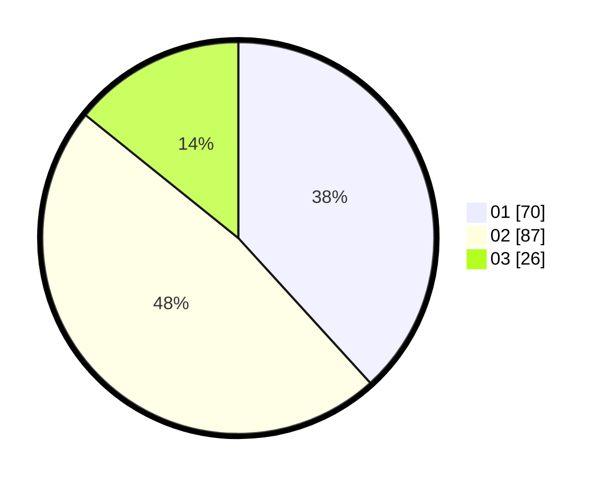

# Hasil

Hasil perolehan suara paslon dapat dilihat pada file paslon-01.txt, paslon-02.txt, dan paslon-03.txt.

Jika tidak ada, artinya data tersebut belum ada pada SIREKAP.

## Perolehan Suara

 * Paslon 01: **70**.
 * Paslon 02: **87**.
 * Paslon 03: **26**.

## Foto C Plano

https://sirekap-obj-formc.kpu.go.id/13f7/pemilu/ppwp/31/75/07/10/04/3175071004134-20240214-223331--59140151-9a52-4ef1-ac51-c803c90853c7.jpg

https://sirekap-obj-formc.kpu.go.id/13f7/pemilu/ppwp/31/75/07/10/04/3175071004134-20240214-223335--dda4955f-ba16-423d-bdfd-ae24f5775ea4.jpg

https://sirekap-obj-formc.kpu.go.id/13f7/pemilu/ppwp/31/75/07/10/04/3175071004134-20240214-223643--6df3cad0-713e-4780-a6b9-4b526125ced5.jpg

## DATA PEMILIH TETAP

Jumlah pemilih dalam DPT: **238**.
 * L: **122**.
 * P: **116**.

## DATA PENGGUNA HAK PILIH

Jumlah pengguna hak pilih dalam DPT: **182**.
 * L: **93**.
 * P: **89**.

Jumlah pengguna hak pilih dalam DPTb: **0**.
 * L: **0**.
 * P: **0**.

Jumlah pengguna hak pilih dalam DPK: **3**.
 * L: **1**.
 * P: **2**.

Jumlah pengguna hak pilih: **185**.
 * L: **94**.
 * P: **91**.

## JUMLAH SUARA SAH DAN TIDAK SAH

JUMLAH SELURUH SUARA SAH: **183**.

JUMLAH SUARA TIDAK SAH: **2**.

JUMLAH SELURUH SUARA SAH DAN SUARA TIDAK SAH: **185**.
