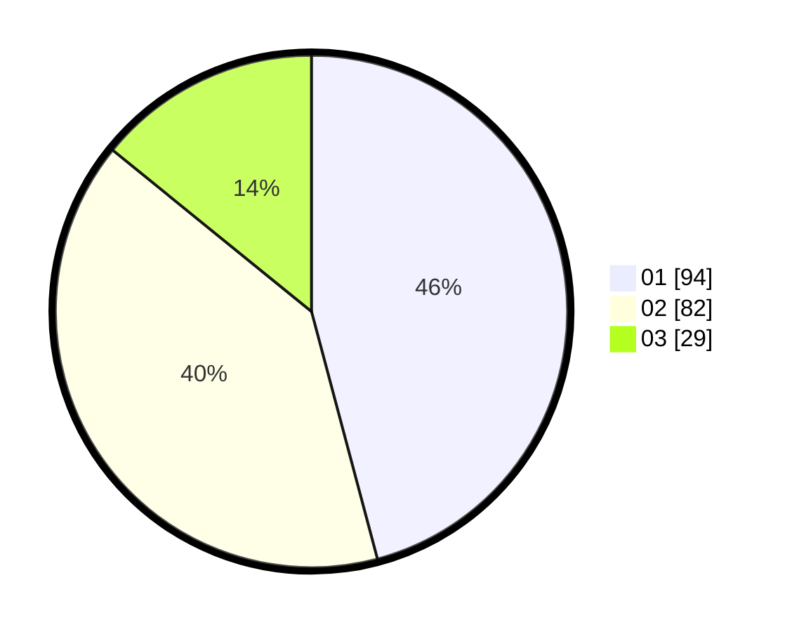

# Hasil

Hasil perolehan suara paslon dapat dilihat pada file paslon-01.txt, paslon-02.txt, dan paslon-03.txt.

Jika tidak ada, artinya data tersebut belum ada pada SIREKAP.

## Perolehan Suara

 * Paslon 01: **94**.
 * Paslon 02: **82**.
 * Paslon 03: **29**.

## Foto C Plano

https://sirekap-obj-formc.kpu.go.id/23ee/pemilu/ppwp/31/75/07/10/04/3175071004136-20240214-191811--bbfb5ef0-0748-466b-817d-02b6bc203dbe.jpg

https://sirekap-obj-formc.kpu.go.id/23ee/pemilu/ppwp/31/75/07/10/04/3175071004136-20240214-191819--39454662-48bb-49dc-9994-1c4ab9612e4d.jpg

https://sirekap-obj-formc.kpu.go.id/23ee/pemilu/ppwp/31/75/07/10/04/3175071004136-20240214-194851--2629a45a-7f66-4d89-9142-cec267e80184.jpg
