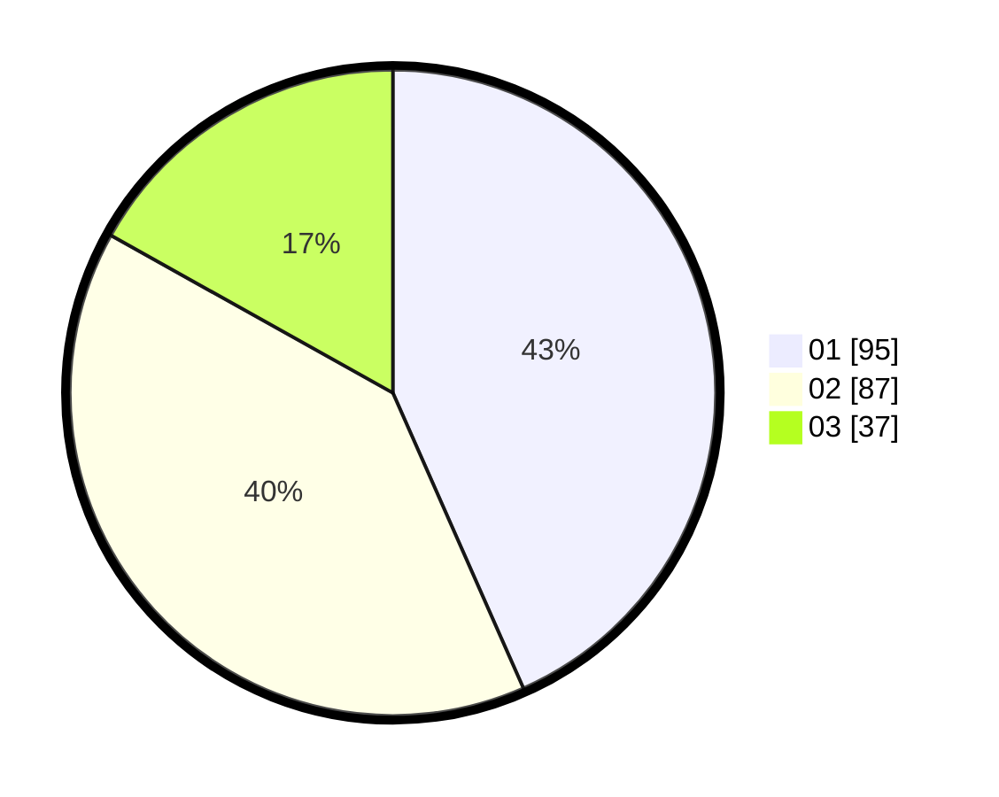

# Hasil

Hasil perolehan suara paslon dapat dilihat pada file paslon-01.txt, paslon-02.txt, dan paslon-03.txt.

Jika tidak ada, artinya data tersebut belum ada pada SIREKAP.

## Perolehan Suara

 * Paslon 01: **95**.
 * Paslon 02: **87**.
 * Paslon 03: **37**.

## Foto C Plano

https://sirekap-obj-formc.kpu.go.id/1a5a/pemilu/ppwp/31/75/07/10/04/3175071004138-20240214-185405--e2b8031e-e973-4efa-b043-43503c5f43af.jpg

https://sirekap-obj-formc.kpu.go.id/1a5a/pemilu/ppwp/31/75/07/10/04/3175071004138-20240214-185437--734b7a72-1a30-4390-ad9c-a15db9243c81.jpg
