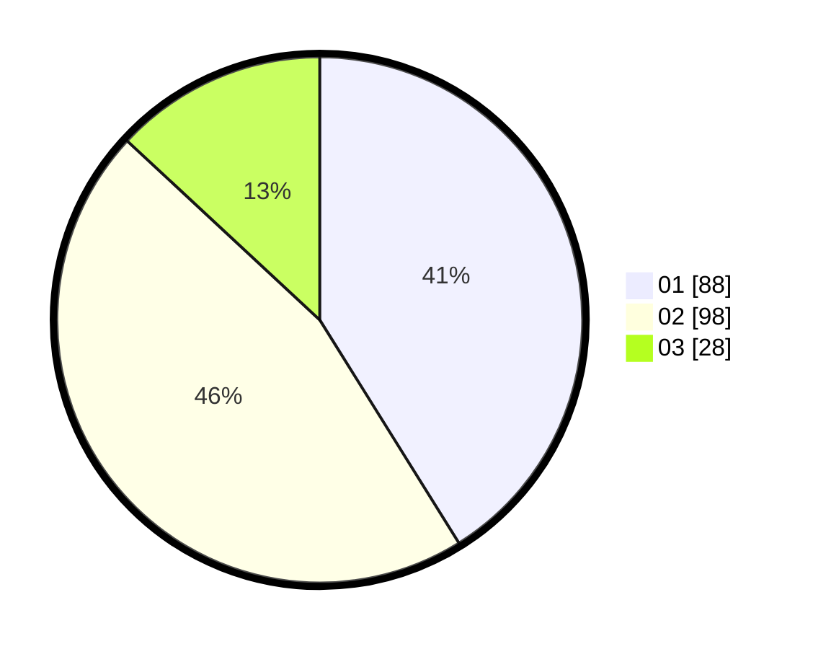

# Hasil

Hasil perolehan suara paslon dapat dilihat pada file paslon-01.txt, paslon-02.txt, dan paslon-03.txt.

Jika tidak ada, artinya data tersebut belum ada pada SIREKAP.

## Perolehan Suara

 * Paslon 01: **88**.
 * Paslon 02: **98**.
 * Paslon 03: **28**.

## Foto C Plano

https://sirekap-obj-formc.kpu.go.id/050c/pemilu/ppwp/31/75/07/10/04/3175071004141-20240216-131233--45fff2de-dbae-4dd5-993e-c0d06652abd2.jpg

https://sirekap-obj-formc.kpu.go.id/050c/pemilu/ppwp/31/75/07/10/04/3175071004141-20240216-131235--06f19827-db63-4ef8-a3df-25a38a8441df.jpg

https://sirekap-obj-formc.kpu.go.id/050c/pemilu/ppwp/31/75/07/10/04/3175071004141-20240216-131234--15a0e71f-8af3-42eb-866b-8ab4aa3c1df5.jpg

## DATA PEMILIH TETAP

Jumlah pemilih dalam DPT: **265**.
 * L: **124**.
 * P: **141**.

## DATA PENGGUNA HAK PILIH

Jumlah pengguna hak pilih dalam DPT: **213**.
 * L: **99**.
 * P: **114**.

Jumlah pengguna hak pilih dalam DPTb: **0**.
 * L: **0**.
 * P: **0**.

Jumlah pengguna hak pilih dalam DPK: **2**.
 * L: **0**.
 * P: **2**.

Jumlah pengguna hak pilih: **215**.
 * L: **99**.
 * P: **116**.

## JUMLAH SUARA SAH DAN TIDAK SAH

JUMLAH SELURUH SUARA SAH: **214**.

JUMLAH SUARA TIDAK SAH: **1**.

JUMLAH SELURUH SUARA SAH DAN SUARA TIDAK SAH: **215**.
