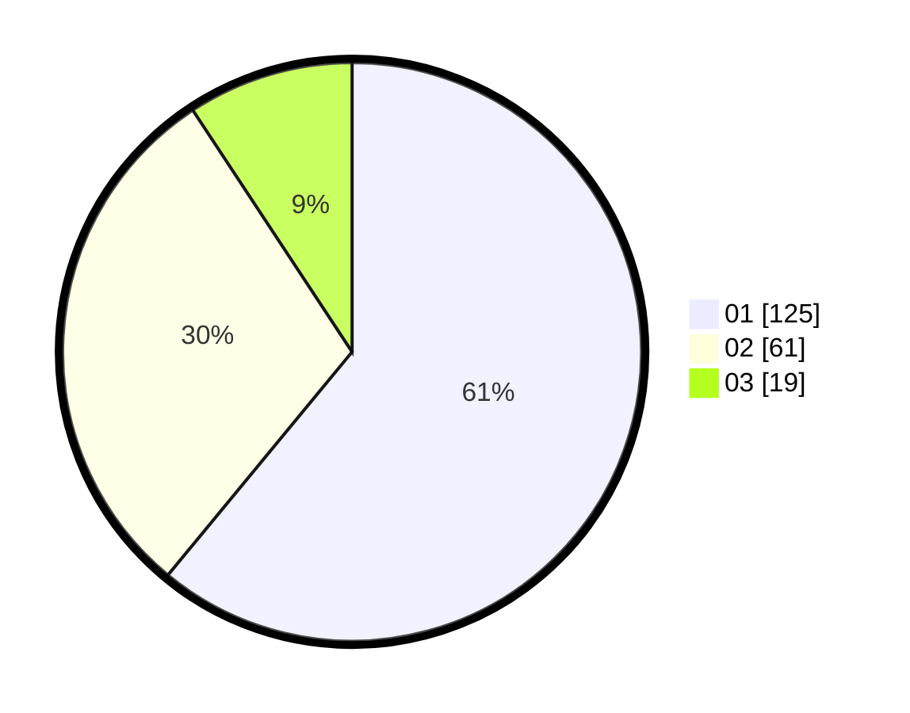

# Hasil

Hasil perolehan suara paslon dapat dilihat pada file paslon-01.txt, paslon-02.txt, dan paslon-03.txt.

Jika tidak ada, artinya data tersebut belum ada pada SIREKAP.

## Perolehan Suara

 * Paslon 01: **125**.
 * Paslon 02: **61**.
 * Paslon 03: **19**.

## Foto C Plano

https://sirekap-obj-formc.kpu.go.id/a36d/pemilu/ppwp/31/75/07/10/04/3175071004142-20240216-144621--b54097e8-d91f-464c-81ca-c6dc5c052249.jpg

https://sirekap-obj-formc.kpu.go.id/a36d/pemilu/ppwp/31/75/07/10/04/3175071004142-20240214-230702--b72cb0f0-f3e3-49af-9d7e-e10514a486d6.jpg

https://sirekap-obj-formc.kpu.go.id/a36d/pemilu/ppwp/31/75/07/10/04/3175071004142-20240216-144621--f90bd06a-20be-43b9-b988-5abf31476d64.jpg

## DATA PEMILIH TETAP

Jumlah pemilih dalam DPT: **262**.
 * L: **142**.
 * P: **120**.

## DATA PENGGUNA HAK PILIH

Jumlah pengguna hak pilih dalam DPT: **214**.
 * L: **117**.
 * P: **97**.

Jumlah pengguna hak pilih dalam DPTb: **0**.
 * L: **0**.
 * P: **0**.

Jumlah pengguna hak pilih dalam DPK: **2**.
 * L: **1**.
 * P: **1**.

Jumlah pengguna hak pilih: **216**.
 * L: **118**.
 * P: **98**.

## JUMLAH SUARA SAH DAN TIDAK SAH

JUMLAH SELURUH SUARA SAH: **205**.

JUMLAH SUARA TIDAK SAH: **11**.

JUMLAH SELURUH SUARA SAH DAN SUARA TIDAK SAH: **216**.
