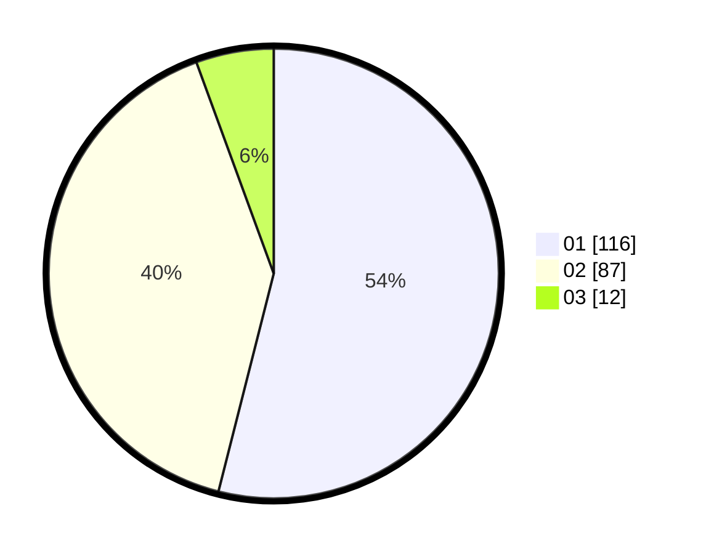

# Hasil

Hasil perolehan suara paslon dapat dilihat pada file paslon-01.txt, paslon-02.txt, dan paslon-03.txt.

Jika tidak ada, artinya data tersebut belum ada pada SIREKAP.

## Perolehan Suara

 * Paslon 01: **116**.
 * Paslon 02: **87**.
 * Paslon 03: **12**.

## Foto C Plano

https://sirekap-obj-formc.kpu.go.id/9663/pemilu/ppwp/31/75/07/10/04/3175071004144-20240214-155346--6bff3f19-481d-4716-b40a-da1ffbd83ee3.jpg

https://sirekap-obj-formc.kpu.go.id/9663/pemilu/ppwp/31/75/07/10/04/3175071004144-20240214-235356--fa94934f-63a2-4343-b2f4-4508cefb065e.jpg

https://sirekap-obj-formc.kpu.go.id/9663/pemilu/ppwp/31/75/07/10/04/3175071004144-20240214-192728--b474dbd7-e958-42fa-8dac-bf0384b6a380.jpg

## DATA PEMILIH TETAP

Jumlah pemilih dalam DPT: **268**.
 * L: **124**.
 * P: **144**.

## DATA PENGGUNA HAK PILIH

Jumlah pengguna hak pilih dalam DPT: **204**.
 * L: **91**.
 * P: **113**.

Jumlah pengguna hak pilih dalam DPTb: **9**.
 * L: **4**.
 * P: **5**.

Jumlah pengguna hak pilih dalam DPK: **4**.
 * L: **1**.
 * P: **3**.

Jumlah pengguna hak pilih: **217**.
 * L: **96**.
 * P: **121**.

## JUMLAH SUARA SAH DAN TIDAK SAH

JUMLAH SELURUH SUARA SAH: **215**.

JUMLAH SUARA TIDAK SAH: **2**.

JUMLAH SELURUH SUARA SAH DAN SUARA TIDAK SAH: **217**.
