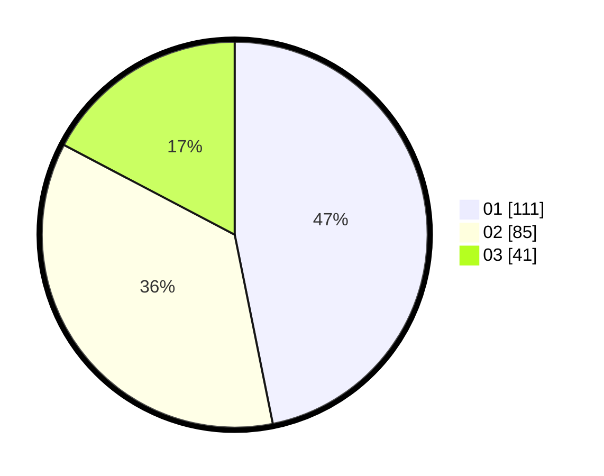

# Hasil

Hasil perolehan suara paslon dapat dilihat pada file paslon-01.txt, paslon-02.txt, dan paslon-03.txt.

Jika tidak ada, artinya data tersebut belum ada pada SIREKAP.

## Perolehan Suara

 * Paslon 01: **111**.
 * Paslon 02: **85**.
 * Paslon 03: **41**.

## Foto C Plano

https://sirekap-obj-formc.kpu.go.id/91b6/pemilu/ppwp/31/75/07/10/04/3175071004146-20240214-190612--c6718086-db3f-437c-97c9-0ded675530df.jpg

https://sirekap-obj-formc.kpu.go.id/91b6/pemilu/ppwp/31/75/07/10/04/3175071004146-20240214-191030--c4c54ed3-ed3f-4ae5-9714-2bde72890716.jpg

https://sirekap-obj-formc.kpu.go.id/91b6/pemilu/ppwp/31/75/07/10/04/3175071004146-20240214-190749--4941bded-a6bb-4064-b141-8546ac98cef3.jpg

## DATA PEMILIH TETAP

Jumlah pemilih dalam DPT: **264**.
 * L: **127**.
 * P: **137**.

## DATA PENGGUNA HAK PILIH

Jumlah pengguna hak pilih dalam DPT: **226**.
 * L: **110**.
 * P: **116**.

Jumlah pengguna hak pilih dalam DPTb: **11**.
 * L: **3**.
 * P: **8**.

Jumlah pengguna hak pilih dalam DPK: **2**.
 * L: **1**.
 * P: **1**.

Jumlah pengguna hak pilih: **239**.
 * L: **114**.
 * P: **125**.

## JUMLAH SUARA SAH DAN TIDAK SAH

JUMLAH SELURUH SUARA SAH: **237**.

JUMLAH SUARA TIDAK SAH: **2**.

JUMLAH SELURUH SUARA SAH DAN SUARA TIDAK SAH: **239**.
