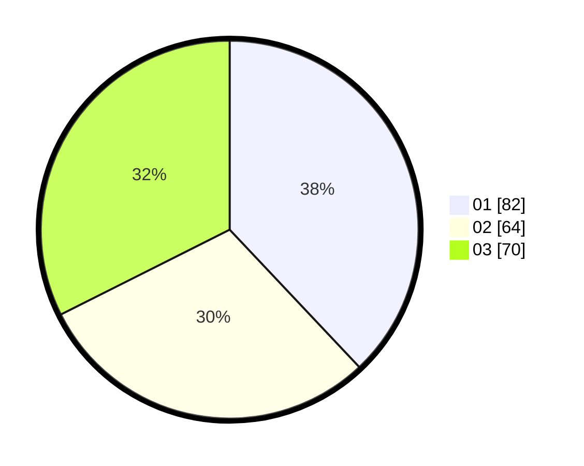

# Hasil

Hasil perolehan suara paslon dapat dilihat pada file paslon-01.txt, paslon-02.txt, dan paslon-03.txt.

Jika tidak ada, artinya data tersebut belum ada pada SIREKAP.

## Perolehan Suara

 * Paslon 01: **82**.
 * Paslon 02: **64**.
 * Paslon 03: **70**.

## Foto C Plano

https://sirekap-obj-formc.kpu.go.id/f4c5/pemilu/ppwp/31/75/07/10/04/3175071004147-20240214-221825--07636db9-57d8-4ea5-a519-d8e1bb543129.jpg

https://sirekap-obj-formc.kpu.go.id/f4c5/pemilu/ppwp/31/75/07/10/04/3175071004147-20240214-184715--0c690f08-ed9a-4651-9a98-81a3567280d9.jpg

https://sirekap-obj-formc.kpu.go.id/f4c5/pemilu/ppwp/31/75/07/10/04/3175071004147-20240214-185400--38aeefce-7999-44c6-ac58-49de707b2a28.jpg
