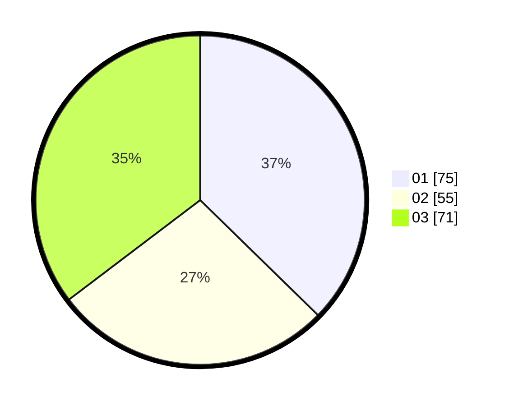

# Hasil

Hasil perolehan suara paslon dapat dilihat pada file paslon-01.txt, paslon-02.txt, dan paslon-03.txt.

Jika tidak ada, artinya data tersebut belum ada pada SIREKAP.

## Perolehan Suara

 * Paslon 01: **75**.
 * Paslon 02: **55**.
 * Paslon 03: **71**.

## Foto C Plano

https://sirekap-obj-formc.kpu.go.id/1b75/pemilu/ppwp/31/75/07/10/04/3175071004148-20240214-202044--ce6b4c9a-adc8-4a8f-b555-25b6ec212204.jpg

https://sirekap-obj-formc.kpu.go.id/1b75/pemilu/ppwp/31/75/07/10/04/3175071004148-20240214-202310--022a15cc-78dc-4ee2-b8ef-9a1905ad682a.jpg

https://sirekap-obj-formc.kpu.go.id/1b75/pemilu/ppwp/31/75/07/10/04/3175071004148-20240214-202531--b7b28593-7552-4d22-9dc7-2f06ddcf85c2.jpg
