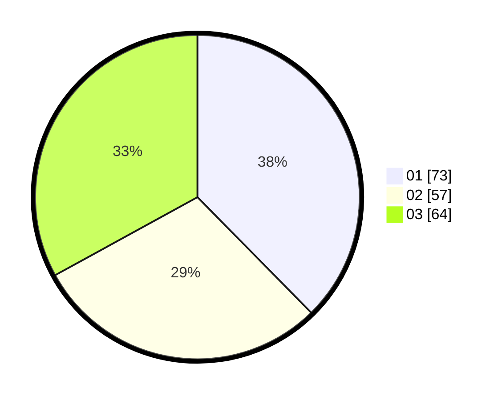

# Hasil

Hasil perolehan suara paslon dapat dilihat pada file paslon-01.txt, paslon-02.txt, dan paslon-03.txt.

Jika tidak ada, artinya data tersebut belum ada pada SIREKAP.

## Perolehan Suara

 * Paslon 01: **73**.
 * Paslon 02: **57**.
 * Paslon 03: **64**.

## Foto C Plano

https://sirekap-obj-formc.kpu.go.id/d39c/pemilu/ppwp/31/75/07/10/04/3175071004149-20240217-102606--8047ee89-c7ea-45b0-87ca-6e56b8505d24.jpg

https://sirekap-obj-formc.kpu.go.id/d39c/pemilu/ppwp/31/75/07/10/04/3175071004149-20240217-102607--d9e48d50-0568-4f16-b497-e66e47e203b2.jpg

https://sirekap-obj-formc.kpu.go.id/d39c/pemilu/ppwp/31/75/07/10/04/3175071004149-20240217-102606--2e345bdc-050d-4745-9f1e-0b65fbb37b6e.jpg

## DATA PEMILIH TETAP

Jumlah pemilih dalam DPT: **228**.
 * L: **104**.
 * P: **124**.

## DATA PENGGUNA HAK PILIH

Jumlah pengguna hak pilih dalam DPT: **195**.
 * L: **83**.
 * P: **112**.

Jumlah pengguna hak pilih dalam DPTb: **1**.
 * L: **0**.
 * P: **1**.

Jumlah pengguna hak pilih dalam DPK: **0**.
 * L: **0**.
 * P: **0**.

Jumlah pengguna hak pilih: **196**.
 * L: **83**.
 * P: **113**.

## JUMLAH SUARA SAH DAN TIDAK SAH

JUMLAH SELURUH SUARA SAH: **194**.

JUMLAH SUARA TIDAK SAH: **2**.

JUMLAH SELURUH SUARA SAH DAN SUARA TIDAK SAH: **196**.
