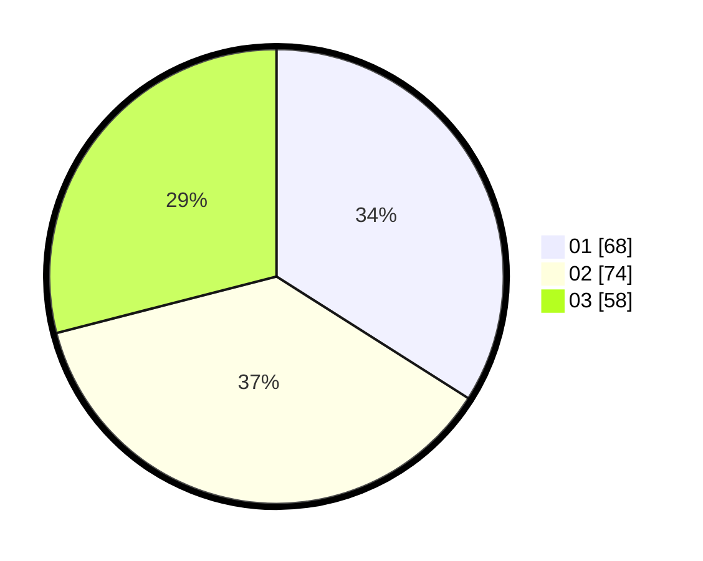

# Hasil

Hasil perolehan suara paslon dapat dilihat pada file paslon-01.txt, paslon-02.txt, dan paslon-03.txt.

Jika tidak ada, artinya data tersebut belum ada pada SIREKAP.

## Perolehan Suara

 * Paslon 01: **68**.
 * Paslon 02: **74**.
 * Paslon 03: **58**.

## Foto C Plano

https://sirekap-obj-formc.kpu.go.id/1b43/pemilu/ppwp/31/75/07/10/04/3175071004157-20240215-005815--5178644e-8a82-4067-be16-db096adaf88e.jpg

https://sirekap-obj-formc.kpu.go.id/1b43/pemilu/ppwp/31/75/07/10/04/3175071004157-20240215-010039--4aaa8e02-60d4-4a43-9345-edc48ef2e46e.jpg

https://sirekap-obj-formc.kpu.go.id/1b43/pemilu/ppwp/31/75/07/10/04/3175071004157-20240215-010244--21e95557-ae13-4501-9863-42c53dd0c143.jpg

## DATA PEMILIH TETAP

Jumlah pemilih dalam DPT: **218**.
 * L: **99**.
 * P: **119**.

## DATA PENGGUNA HAK PILIH

Jumlah pengguna hak pilih dalam DPT: **180**.
 * L: **82**.
 * P: **98**.

Jumlah pengguna hak pilih dalam DPTb: **18**.
 * L: **2**.
 * P: **16**.

Jumlah pengguna hak pilih dalam DPK: **4**.
 * L: **1**.
 * P: **3**.

Jumlah pengguna hak pilih: **202**.
 * L: **85**.
 * P: **117**.

## JUMLAH SUARA SAH DAN TIDAK SAH

JUMLAH SELURUH SUARA SAH: **200**.

JUMLAH SUARA TIDAK SAH: **2**.

JUMLAH SELURUH SUARA SAH DAN SUARA TIDAK SAH: **202**.
