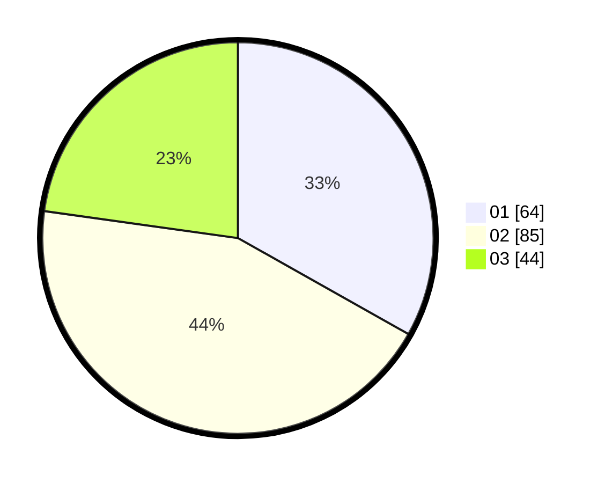

# Hasil

Hasil perolehan suara paslon dapat dilihat pada file paslon-01.txt, paslon-02.txt, dan paslon-03.txt.

Jika tidak ada, artinya data tersebut belum ada pada SIREKAP.

## Perolehan Suara

 * Paslon 01: **64**.
 * Paslon 02: **85**.
 * Paslon 03: **44**.

## Foto C Plano

https://sirekap-obj-formc.kpu.go.id/4bf3/pemilu/ppwp/31/75/07/10/04/3175071004161-20240214-201656--eb083152-a738-421f-9836-a003e5c81624.jpg

https://sirekap-obj-formc.kpu.go.id/4bf3/pemilu/ppwp/31/75/07/10/04/3175071004161-20240214-201749--e78bcce1-983b-4d2b-bc5e-a703ad28265e.jpg

https://sirekap-obj-formc.kpu.go.id/4bf3/pemilu/ppwp/31/75/07/10/04/3175071004161-20240214-201829--b263d922-a330-4e7e-a939-49b9792c3455.jpg

## DATA PEMILIH TETAP

Jumlah pemilih dalam DPT: **246**.
 * L: **118**.
 * P: **128**.

## DATA PENGGUNA HAK PILIH

Jumlah pengguna hak pilih dalam DPT: **196**.
 * L: **93**.
 * P: **103**.

Jumlah pengguna hak pilih dalam DPTb: **0**.
 * L: **0**.
 * P: **0**.

Jumlah pengguna hak pilih dalam DPK: **2**.
 * L: **1**.
 * P: **1**.

Jumlah pengguna hak pilih: **198**.
 * L: **94**.
 * P: **104**.

## JUMLAH SUARA SAH DAN TIDAK SAH

JUMLAH SELURUH SUARA SAH: **193**.

JUMLAH SUARA TIDAK SAH: **5**.

JUMLAH SELURUH SUARA SAH DAN SUARA TIDAK SAH: **198**.
