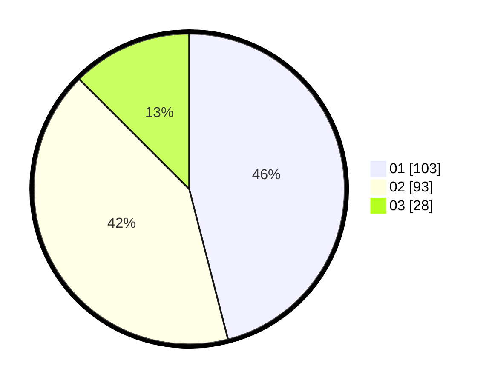

# Hasil

Hasil perolehan suara paslon dapat dilihat pada file paslon-01.txt, paslon-02.txt, dan paslon-03.txt.

Jika tidak ada, artinya data tersebut belum ada pada SIREKAP.

## Perolehan Suara

 * Paslon 01: **103**.
 * Paslon 02: **93**.
 * Paslon 03: **28**.

## Foto C Plano

https://sirekap-obj-formc.kpu.go.id/6885/pemilu/ppwp/31/75/07/10/04/3175071004165-20240216-014137--2db0d8ab-3f98-4e52-8f96-7d5814c0eb6d.jpg

https://sirekap-obj-formc.kpu.go.id/6885/pemilu/ppwp/31/75/07/10/04/3175071004165-20240216-014140--0943916c-b749-47b8-b5f9-5b89b8936a87.jpg

https://sirekap-obj-formc.kpu.go.id/6885/pemilu/ppwp/31/75/07/10/04/3175071004165-20240216-014139--80aeb7df-3f65-42ac-bd7a-f3680096347f.jpg

## DATA PEMILIH TETAP

Jumlah pemilih dalam DPT: **276**.
 * L: **134**.
 * P: **142**.

## DATA PENGGUNA HAK PILIH

Jumlah pengguna hak pilih dalam DPT: **220**.
 * L: **100**.
 * P: **120**.

Jumlah pengguna hak pilih dalam DPTb: **6**.
 * L: **3**.
 * P: **3**.

Jumlah pengguna hak pilih dalam DPK: **4**.
 * L: **2**.
 * P: **2**.

Jumlah pengguna hak pilih: **230**.
 * L: **105**.
 * P: **125**.

## JUMLAH SUARA SAH DAN TIDAK SAH

JUMLAH SELURUH SUARA SAH: **224**.

JUMLAH SUARA TIDAK SAH: **6**.

JUMLAH SELURUH SUARA SAH DAN SUARA TIDAK SAH: **230**.
