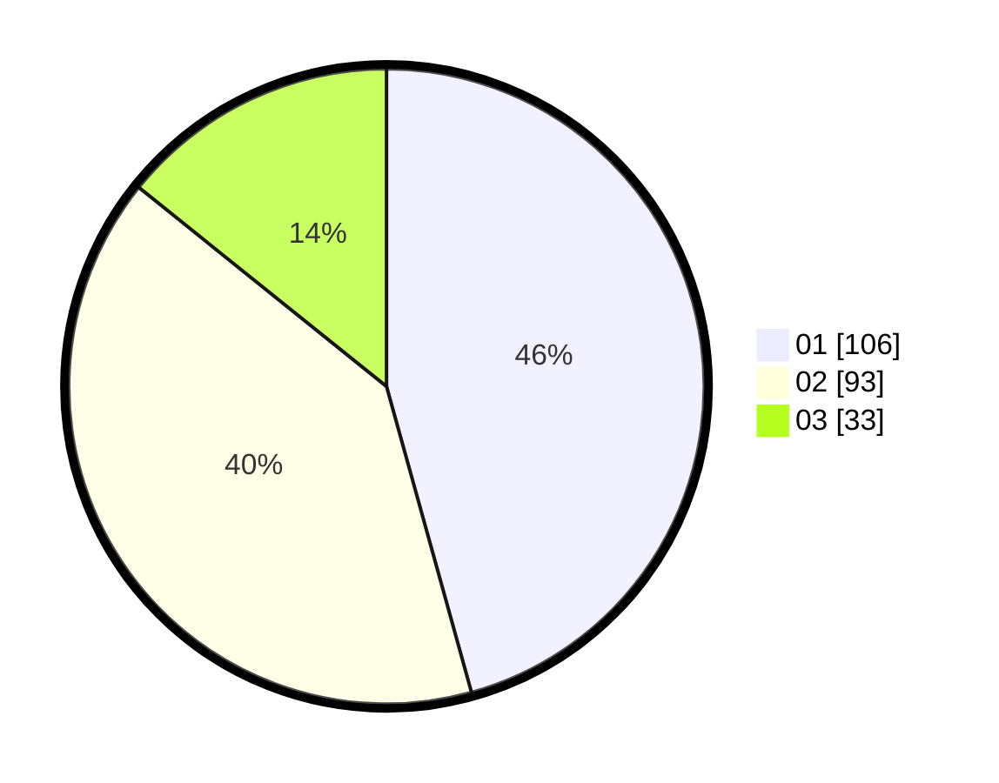

# Hasil

Hasil perolehan suara paslon dapat dilihat pada file paslon-01.txt, paslon-02.txt, dan paslon-03.txt.

Jika tidak ada, artinya data tersebut belum ada pada SIREKAP.

## Perolehan Suara

 * Paslon 01: **106**.
 * Paslon 02: **93**.
 * Paslon 03: **33**.

## Foto C Plano

https://sirekap-obj-formc.kpu.go.id/3d58/pemilu/ppwp/31/75/07/10/04/3175071004166-20240214-201935--4ba5e094-03ae-4350-a504-cb4fecbea957.jpg

https://sirekap-obj-formc.kpu.go.id/3d58/pemilu/ppwp/31/75/07/10/04/3175071004166-20240214-202053--aa793e7a-5019-40f4-9385-e082403bfc37.jpg

https://sirekap-obj-formc.kpu.go.id/3d58/pemilu/ppwp/31/75/07/10/04/3175071004166-20240214-202449--fa9578d7-1324-4f35-9317-ac80f6296937.jpg

## DATA PEMILIH TETAP

Jumlah pemilih dalam DPT: **271**.
 * L: **141**.
 * P: **130**.

## DATA PENGGUNA HAK PILIH

Jumlah pengguna hak pilih dalam DPT: **232**.
 * L: **115**.
 * P: **117**.

Jumlah pengguna hak pilih dalam DPTb: **1**.
 * L: **1**.
 * P: **0**.

Jumlah pengguna hak pilih dalam DPK: **0**.
 * L: **0**.
 * P: **0**.

Jumlah pengguna hak pilih: **233**.
 * L: **116**.
 * P: **117**.

## JUMLAH SUARA SAH DAN TIDAK SAH

JUMLAH SELURUH SUARA SAH: **232**.

JUMLAH SUARA TIDAK SAH: **1**.

JUMLAH SELURUH SUARA SAH DAN SUARA TIDAK SAH: **233**.
