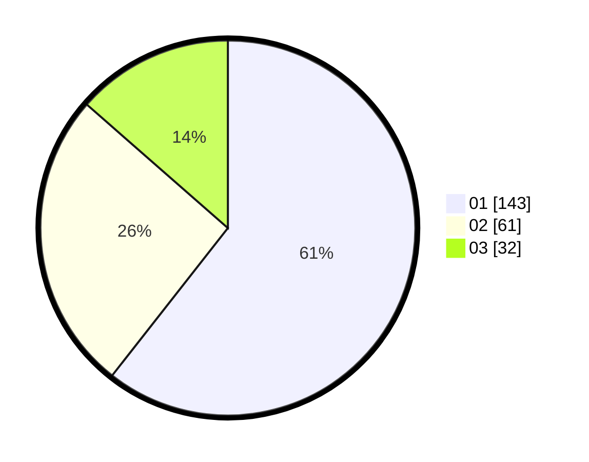

# Hasil

Hasil perolehan suara paslon dapat dilihat pada file paslon-01.txt, paslon-02.txt, dan paslon-03.txt.

Jika tidak ada, artinya data tersebut belum ada pada SIREKAP.

## Perolehan Suara

 * Paslon 01: **143**.
 * Paslon 02: **61**.
 * Paslon 03: **32**.

## Foto C Plano

https://sirekap-obj-formc.kpu.go.id/1489/pemilu/ppwp/31/75/07/10/04/3175071004167-20240214-185452--4330c69c-52ab-4508-8521-2a6f8c2093b3.jpg

https://sirekap-obj-formc.kpu.go.id/1489/pemilu/ppwp/31/75/07/10/04/3175071004167-20240214-192008--bfd2171f-aea5-4365-a1b0-881aa687582f.jpg

https://sirekap-obj-formc.kpu.go.id/1489/pemilu/ppwp/31/75/07/10/04/3175071004167-20240214-191256--09b4012b-9c55-41a3-b559-ddee9f5237ea.jpg

## DATA PEMILIH TETAP

Jumlah pemilih dalam DPT: **272**.
 * L: **128**.
 * P: **144**.

## DATA PENGGUNA HAK PILIH

Jumlah pengguna hak pilih dalam DPT: **230**.
 * L: **103**.
 * P: **127**.

Jumlah pengguna hak pilih dalam DPTb: **0**.
 * L: **0**.
 * P: **0**.

Jumlah pengguna hak pilih dalam DPK: **9**.
 * L: **2**.
 * P: **7**.

Jumlah pengguna hak pilih: **239**.
 * L: **105**.
 * P: **134**.

## JUMLAH SUARA SAH DAN TIDAK SAH

JUMLAH SELURUH SUARA SAH: **236**.

JUMLAH SUARA TIDAK SAH: **3**.

JUMLAH SELURUH SUARA SAH DAN SUARA TIDAK SAH: **239**.
