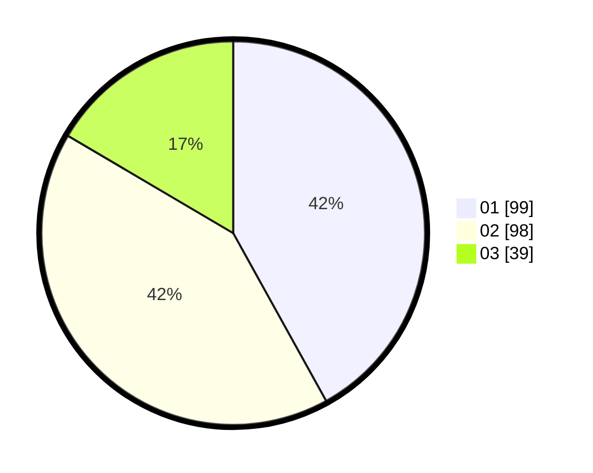

# Hasil

Hasil perolehan suara paslon dapat dilihat pada file paslon-01.txt, paslon-02.txt, dan paslon-03.txt.

Jika tidak ada, artinya data tersebut belum ada pada SIREKAP.

## Perolehan Suara

 * Paslon 01: **99**.
 * Paslon 02: **98**.
 * Paslon 03: **39**.

## Foto C Plano

https://sirekap-obj-formc.kpu.go.id/df6e/pemilu/ppwp/31/75/07/10/04/3175071004169-20240214-223624--d061ea02-c64d-4ffe-8228-b73c0c2cb590.jpg

https://sirekap-obj-formc.kpu.go.id/df6e/pemilu/ppwp/31/75/07/10/04/3175071004169-20240214-223759--f77add05-86bd-4846-b77c-bffc8cfb82da.jpg

https://sirekap-obj-formc.kpu.go.id/df6e/pemilu/ppwp/31/75/07/10/04/3175071004169-20240214-223909--0f73cddc-c5ce-45da-a0a4-c388d3ba6785.jpg

## DATA PEMILIH TETAP

Jumlah pemilih dalam DPT: **286**.
 * L: **139**.
 * P: **147**.

## DATA PENGGUNA HAK PILIH

Jumlah pengguna hak pilih dalam DPT: **238**.
 * L: **115**.
 * P: **123**.

Jumlah pengguna hak pilih dalam DPTb: **2**.
 * L: **1**.
 * P: **1**.

Jumlah pengguna hak pilih dalam DPK: **0**.
 * L: **0**.
 * P: **0**.

Jumlah pengguna hak pilih: **240**.
 * L: **116**.
 * P: **124**.

## JUMLAH SUARA SAH DAN TIDAK SAH

JUMLAH SELURUH SUARA SAH: **236**.

JUMLAH SUARA TIDAK SAH: **4**.

JUMLAH SELURUH SUARA SAH DAN SUARA TIDAK SAH: **240**.
