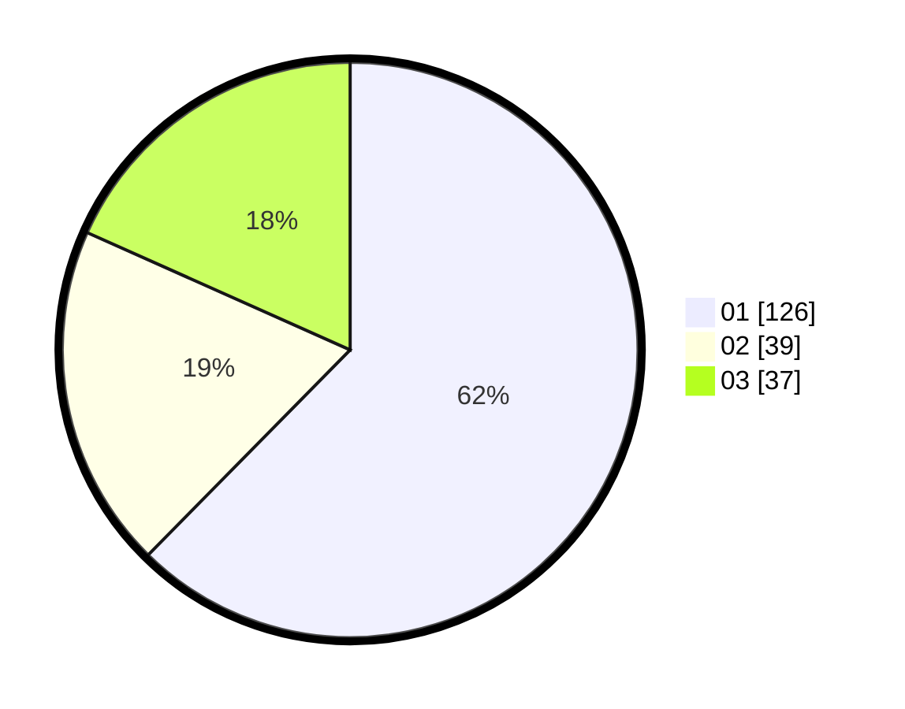

# Hasil

Hasil perolehan suara paslon dapat dilihat pada file paslon-01.txt, paslon-02.txt, dan paslon-03.txt.

Jika tidak ada, artinya data tersebut belum ada pada SIREKAP.

## Perolehan Suara

 * Paslon 01: **126**.
 * Paslon 02: **39**.
 * Paslon 03: **37**.

## Foto C Plano

https://sirekap-obj-formc.kpu.go.id/12db/pemilu/ppwp/31/75/07/10/04/3175071004194-20240215-205320--4ebba35a-15a3-4ffe-bc0d-691ca86ee097.jpg

https://sirekap-obj-formc.kpu.go.id/12db/pemilu/ppwp/31/75/07/10/04/3175071004194-20240215-205322--519f4ad9-b282-494c-8a1e-3ef80110d58c.jpg

https://sirekap-obj-formc.kpu.go.id/12db/pemilu/ppwp/31/75/07/10/04/3175071004194-20240215-205321--b8a06a4d-a21e-4e21-849b-f6aaac41e1e8.jpg

## DATA PEMILIH TETAP

Jumlah pemilih dalam DPT: **240**.
 * L: **120**.
 * P: **120**.

## DATA PENGGUNA HAK PILIH

Jumlah pengguna hak pilih dalam DPT: **199**.
 * L: **96**.
 * P: **103**.

Jumlah pengguna hak pilih dalam DPTb: **4**.
 * L: **0**.
 * P: **4**.

Jumlah pengguna hak pilih dalam DPK: **1**.
 * L: **1**.
 * P: **0**.

Jumlah pengguna hak pilih: **204**.
 * L: **97**.
 * P: **107**.

## JUMLAH SUARA SAH DAN TIDAK SAH

JUMLAH SELURUH SUARA SAH: **202**.

JUMLAH SUARA TIDAK SAH: **2**.

JUMLAH SELURUH SUARA SAH DAN SUARA TIDAK SAH: **204**.
