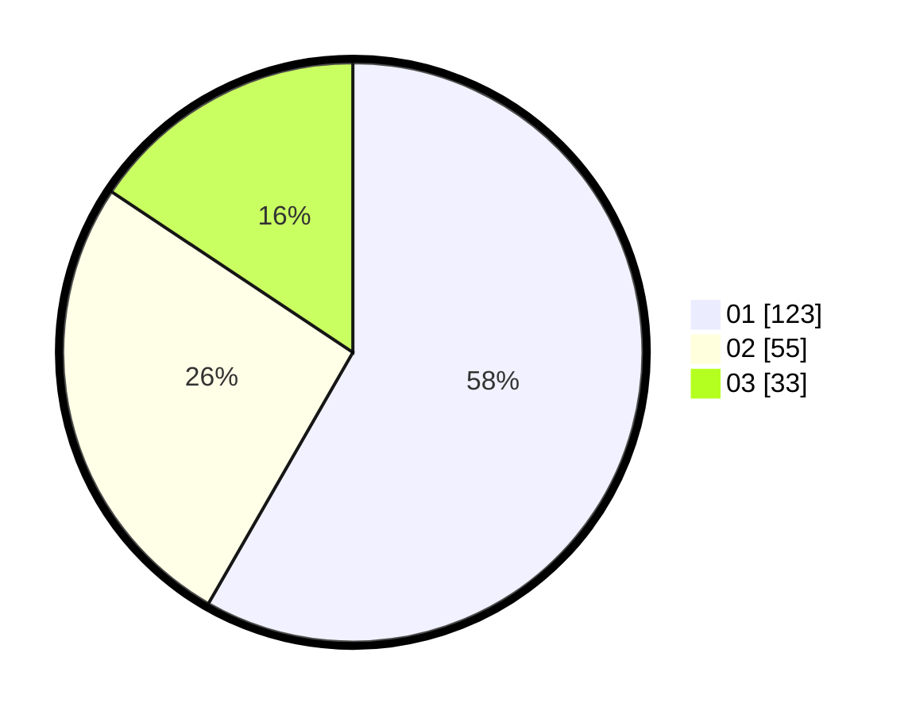

# Hasil

Hasil perolehan suara paslon dapat dilihat pada file paslon-01.txt, paslon-02.txt, dan paslon-03.txt.

Jika tidak ada, artinya data tersebut belum ada pada SIREKAP.

## Perolehan Suara

 * Paslon 01: **123**.
 * Paslon 02: **55**.
 * Paslon 03: **33**.

## Foto C Plano

https://sirekap-obj-formc.kpu.go.id/4540/pemilu/ppwp/31/75/07/10/04/3175071004205-20240214-192712--9deda4e5-2a69-4ce8-a308-c4a7ecea5c99.jpg

https://sirekap-obj-formc.kpu.go.id/4540/pemilu/ppwp/31/75/07/10/04/3175071004205-20240214-192749--6d23dafc-94a8-4cfa-9702-32902d7f50ce.jpg

https://sirekap-obj-formc.kpu.go.id/4540/pemilu/ppwp/31/75/07/10/04/3175071004205-20240214-192821--bc8f8322-9159-4008-ba16-83b9c3f404b6.jpg

## DATA PEMILIH TETAP

Jumlah pemilih dalam DPT: **239**.
 * L: **105**.
 * P: **134**.

## DATA PENGGUNA HAK PILIH

Jumlah pengguna hak pilih dalam DPT: **200**.
 * L: **88**.
 * P: **112**.

Jumlah pengguna hak pilih dalam DPTb: **12**.
 * L: **6**.
 * P: **6**.

Jumlah pengguna hak pilih dalam DPK: **2**.
 * L: **1**.
 * P: **1**.

Jumlah pengguna hak pilih: **214**.
 * L: **95**.
 * P: **119**.

## JUMLAH SUARA SAH DAN TIDAK SAH

JUMLAH SELURUH SUARA SAH: **211**.

JUMLAH SUARA TIDAK SAH: **3**.

JUMLAH SELURUH SUARA SAH DAN SUARA TIDAK SAH: **214**.
