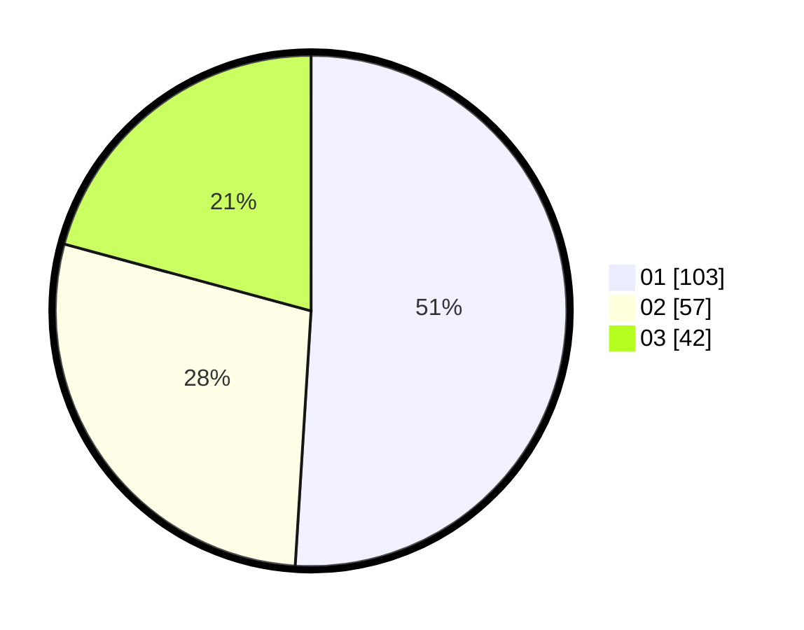

# Hasil

Hasil perolehan suara paslon dapat dilihat pada file paslon-01.txt, paslon-02.txt, dan paslon-03.txt.

Jika tidak ada, artinya data tersebut belum ada pada SIREKAP.

## Perolehan Suara

 * Paslon 01: **103**.
 * Paslon 02: **57**.
 * Paslon 03: **42**.

## Foto C Plano

https://sirekap-obj-formc.kpu.go.id/b6fc/pemilu/ppwp/31/75/07/10/04/3175071004208-20240214-160101--312d1554-8763-4254-8dd0-8541ae6c1451.jpg

https://sirekap-obj-formc.kpu.go.id/b6fc/pemilu/ppwp/31/75/07/10/04/3175071004208-20240214-160152--52c140e7-4402-45f4-8bdd-52e2079a336b.jpg

https://sirekap-obj-formc.kpu.go.id/b6fc/pemilu/ppwp/31/75/07/10/04/3175071004208-20240214-191836--cae743c3-a14f-4fa1-904d-fe32724921d7.jpg

## DATA PEMILIH TETAP

Jumlah pemilih dalam DPT: **235**.
 * L: **109**.
 * P: **126**.

## DATA PENGGUNA HAK PILIH

Jumlah pengguna hak pilih dalam DPT: **199**.
 * L: **89**.
 * P: **110**.

Jumlah pengguna hak pilih dalam DPTb: **5**.
 * L: **1**.
 * P: **4**.

Jumlah pengguna hak pilih dalam DPK: **0**.
 * L: **0**.
 * P: **0**.

Jumlah pengguna hak pilih: **204**.
 * L: **90**.
 * P: **114**.

## JUMLAH SUARA SAH DAN TIDAK SAH

JUMLAH SELURUH SUARA SAH: **202**.

JUMLAH SUARA TIDAK SAH: **2**.

JUMLAH SELURUH SUARA SAH DAN SUARA TIDAK SAH: **204**.
