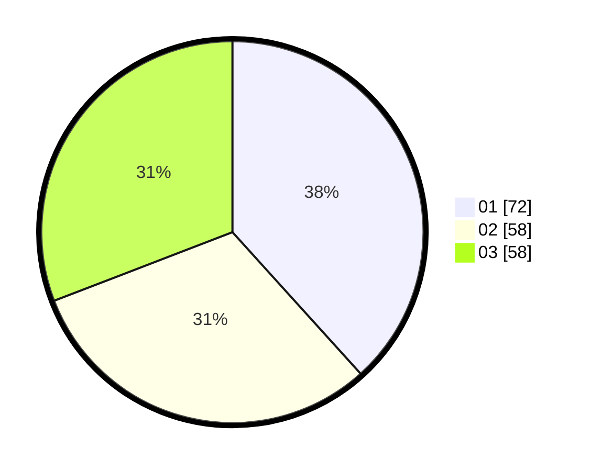

# Hasil

Hasil perolehan suara paslon dapat dilihat pada file paslon-01.txt, paslon-02.txt, dan paslon-03.txt.

Jika tidak ada, artinya data tersebut belum ada pada SIREKAP.

## Perolehan Suara

 * Paslon 01: **72**.
 * Paslon 02: **58**.
 * Paslon 03: **58**.

## Foto C Plano

https://sirekap-obj-formc.kpu.go.id/a2ce/pemilu/ppwp/31/75/07/10/04/3175071004211-20240214-192804--ab79b08b-4d50-4528-9193-f22d8677a835.jpg

https://sirekap-obj-formc.kpu.go.id/a2ce/pemilu/ppwp/31/75/07/10/04/3175071004211-20240214-192816--8df76255-cc1a-48e6-ac75-b4137b2d7d40.jpg

https://sirekap-obj-formc.kpu.go.id/a2ce/pemilu/ppwp/31/75/07/10/04/3175071004211-20240214-192822--2c6c1fd6-a263-4517-9826-dfa95dc929c4.jpg

## DATA PEMILIH TETAP

Jumlah pemilih dalam DPT: **225**.
 * L: **96**.
 * P: **129**.

## DATA PENGGUNA HAK PILIH

Jumlah pengguna hak pilih dalam DPT: **180**.
 * L: **77**.
 * P: **103**.

Jumlah pengguna hak pilih dalam DPTb: **10**.
 * L: **7**.
 * P: **3**.

Jumlah pengguna hak pilih dalam DPK: **1**.
 * L: **1**.
 * P: **0**.

Jumlah pengguna hak pilih: **191**.
 * L: **85**.
 * P: **106**.

## JUMLAH SUARA SAH DAN TIDAK SAH

JUMLAH SELURUH SUARA SAH: **188**.

JUMLAH SUARA TIDAK SAH: **3**.

JUMLAH SELURUH SUARA SAH DAN SUARA TIDAK SAH: **191**.
