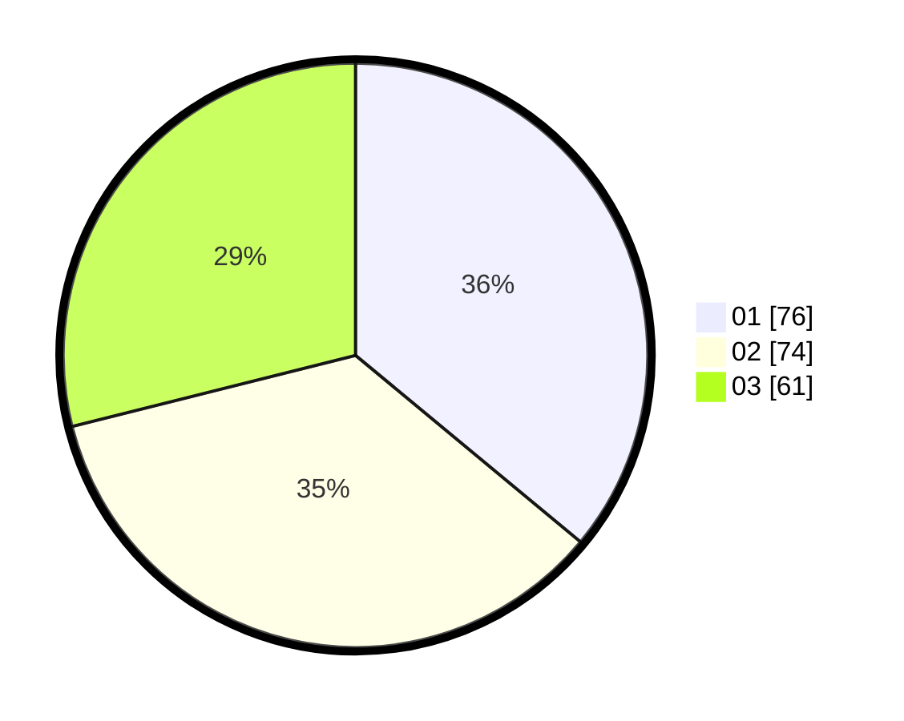

# Hasil

Hasil perolehan suara paslon dapat dilihat pada file paslon-01.txt, paslon-02.txt, dan paslon-03.txt.

Jika tidak ada, artinya data tersebut belum ada pada SIREKAP.

## Perolehan Suara

 * Paslon 01: **76**.
 * Paslon 02: **74**.
 * Paslon 03: **61**.

## Foto C Plano

https://sirekap-obj-formc.kpu.go.id/f542/pemilu/ppwp/31/75/07/10/04/3175071004212-20240215-151917--70880205-228c-4413-9cd2-900d1ba9fabb.jpg

https://sirekap-obj-formc.kpu.go.id/f542/pemilu/ppwp/31/75/07/10/04/3175071004212-20240214-214556--622f3aeb-8125-4dd1-b7d4-6a0f0f07f5a8.jpg

https://sirekap-obj-formc.kpu.go.id/f542/pemilu/ppwp/31/75/07/10/04/3175071004212-20240214-214655--913e9b08-907e-4093-8355-7b5aeb5697d9.jpg
