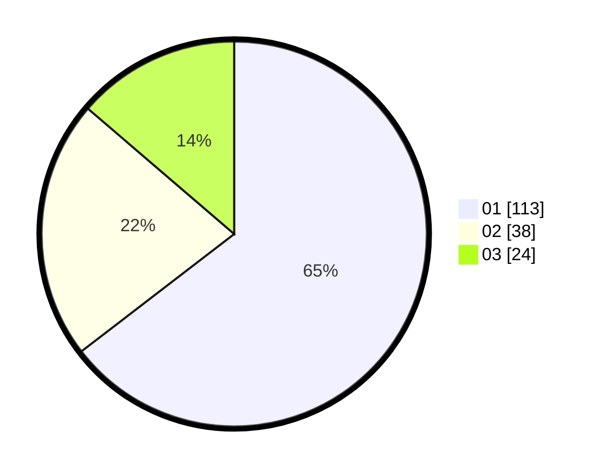

# Hasil

Hasil perolehan suara paslon dapat dilihat pada file paslon-01.txt, paslon-02.txt, dan paslon-03.txt.

Jika tidak ada, artinya data tersebut belum ada pada SIREKAP.

## Perolehan Suara

 * Paslon 01: **113**.
 * Paslon 02: **38**.
 * Paslon 03: **24**.

## Foto C Plano

https://sirekap-obj-formc.kpu.go.id/94ea/pemilu/ppwp/31/75/07/10/04/3175071004225-20240214-221601--a1e35766-7cf3-44df-bb54-68fb36365d06.jpg

https://sirekap-obj-formc.kpu.go.id/94ea/pemilu/ppwp/31/75/07/10/04/3175071004225-20240214-221726--f900c9b5-2a2e-480d-81fd-ab4fc0531054.jpg

https://sirekap-obj-formc.kpu.go.id/94ea/pemilu/ppwp/31/75/07/10/04/3175071004225-20240214-221903--aac6d56f-0c67-444b-a4f9-b63898efd391.jpg
