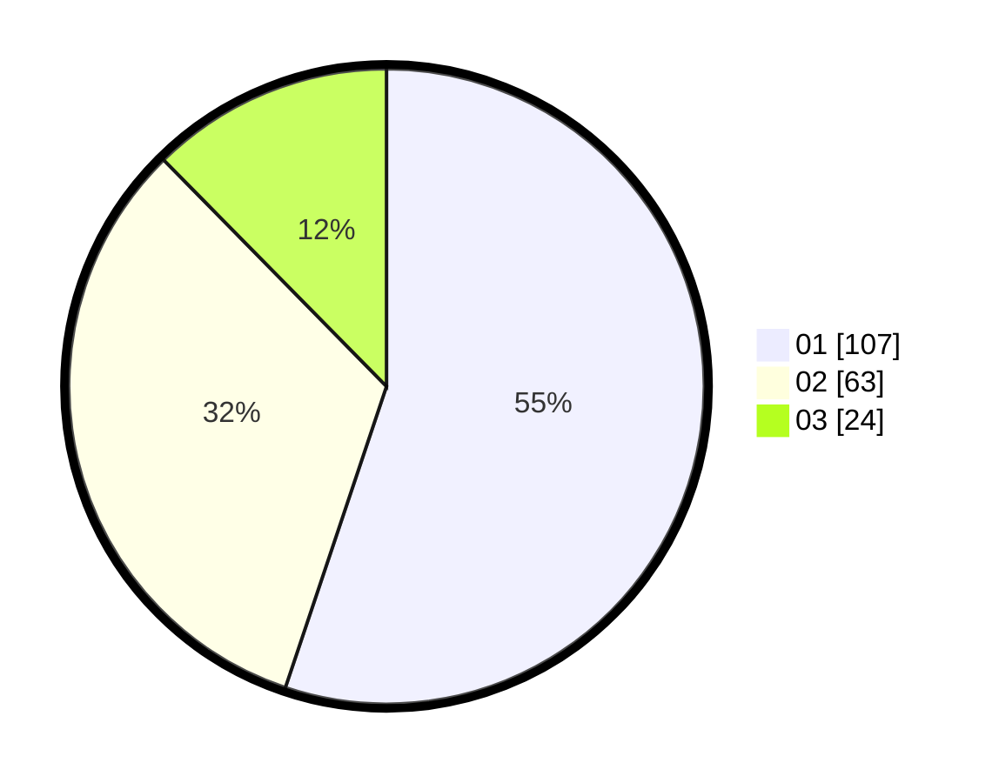

# Hasil

Hasil perolehan suara paslon dapat dilihat pada file paslon-01.txt, paslon-02.txt, dan paslon-03.txt.

Jika tidak ada, artinya data tersebut belum ada pada SIREKAP.

## Perolehan Suara

 * Paslon 01: **107**.
 * Paslon 02: **63**.
 * Paslon 03: **24**.

## Foto C Plano

https://sirekap-obj-formc.kpu.go.id/11c5/pemilu/ppwp/31/75/07/10/04/3175071004229-20240214-215743--413ab2e6-025f-45ba-92bc-ee41e519b11f.jpg

https://sirekap-obj-formc.kpu.go.id/11c5/pemilu/ppwp/31/75/07/10/04/3175071004229-20240215-135146--2e4e73a1-a7c6-41d2-9753-1b14f6b1387c.jpg

https://sirekap-obj-formc.kpu.go.id/11c5/pemilu/ppwp/31/75/07/10/04/3175071004229-20240215-135314--60dad2ec-6ab9-4b57-99dd-5e41ed7e36f9.jpg

## DATA PEMILIH TETAP

Jumlah pemilih dalam DPT: **231**.
 * L: **109**.
 * P: **122**.

## DATA PENGGUNA HAK PILIH

Jumlah pengguna hak pilih dalam DPT: **188**.
 * L: **93**.
 * P: **95**.

Jumlah pengguna hak pilih dalam DPTb: **6**.
 * L: **4**.
 * P: **2**.

Jumlah pengguna hak pilih dalam DPK: **1**.
 * L: **1**.
 * P: **0**.

Jumlah pengguna hak pilih: **195**.
 * L: **98**.
 * P: **97**.

## JUMLAH SUARA SAH DAN TIDAK SAH

JUMLAH SELURUH SUARA SAH: **194**.

JUMLAH SUARA TIDAK SAH: **1**.

JUMLAH SELURUH SUARA SAH DAN SUARA TIDAK SAH: **195**.
