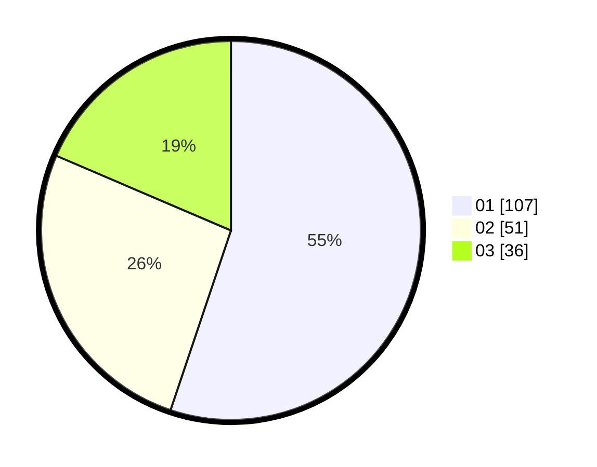

# Hasil

Hasil perolehan suara paslon dapat dilihat pada file paslon-01.txt, paslon-02.txt, dan paslon-03.txt.

Jika tidak ada, artinya data tersebut belum ada pada SIREKAP.

## Perolehan Suara

 * Paslon 01: **107**.
 * Paslon 02: **51**.
 * Paslon 03: **36**.

## Foto C Plano

https://sirekap-obj-formc.kpu.go.id/dff3/pemilu/ppwp/31/75/07/10/04/3175071004230-20240214-191812--67f9fdc5-3e40-4806-9f1d-859eb2138050.jpg

https://sirekap-obj-formc.kpu.go.id/dff3/pemilu/ppwp/31/75/07/10/04/3175071004230-20240214-191833--cff7233d-cff1-438e-b47a-39bdb6afc44b.jpg

https://sirekap-obj-formc.kpu.go.id/dff3/pemilu/ppwp/31/75/07/10/04/3175071004230-20240214-191911--45de12ca-56a0-4e30-9caf-52cd900a6c0e.jpg

## DATA PEMILIH TETAP

Jumlah pemilih dalam DPT: **229**.
 * L: **117**.
 * P: **112**.

## DATA PENGGUNA HAK PILIH

Jumlah pengguna hak pilih dalam DPT: **191**.
 * L: **99**.
 * P: **92**.

Jumlah pengguna hak pilih dalam DPTb: **3**.
 * L: **1**.
 * P: **2**.

Jumlah pengguna hak pilih dalam DPK: **1**.
 * L: **0**.
 * P: **1**.

Jumlah pengguna hak pilih: **195**.
 * L: **100**.
 * P: **95**.

## JUMLAH SUARA SAH DAN TIDAK SAH

JUMLAH SELURUH SUARA SAH: **194**.

JUMLAH SUARA TIDAK SAH: **1**.

JUMLAH SELURUH SUARA SAH DAN SUARA TIDAK SAH: **195**.
