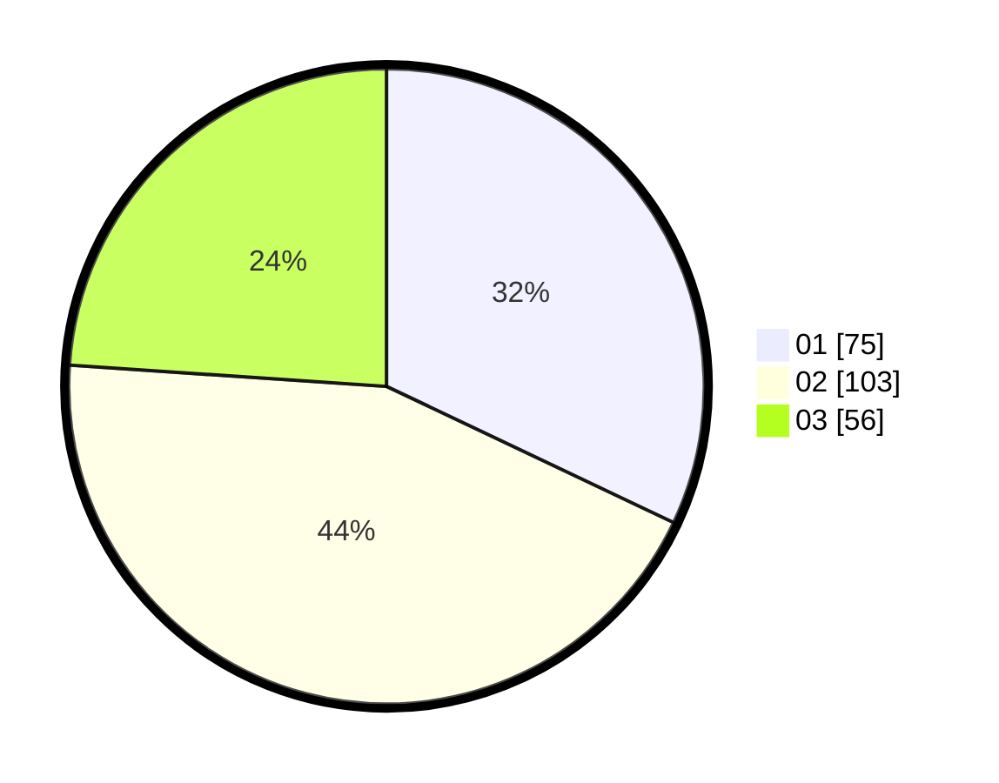

# Hasil

Hasil perolehan suara paslon dapat dilihat pada file paslon-01.txt, paslon-02.txt, dan paslon-03.txt.

Jika tidak ada, artinya data tersebut belum ada pada SIREKAP.

## Perolehan Suara

 * Paslon 01: **75**.
 * Paslon 02: **103**.
 * Paslon 03: **56**.

## Foto C Plano

https://sirekap-obj-formc.kpu.go.id/1879/pemilu/ppwp/31/75/07/10/04/3175071004241-20240215-162502--b630575d-a800-47b5-9957-58a4d5ec0168.jpg

https://sirekap-obj-formc.kpu.go.id/1879/pemilu/ppwp/31/75/07/10/04/3175071004241-20240215-162524--66bbda5b-0e64-4102-8973-cc3074d2aaa9.jpg

https://sirekap-obj-formc.kpu.go.id/1879/pemilu/ppwp/31/75/07/10/04/3175071004241-20240215-162539--e5174ed3-21bf-461f-9da2-bddcff5e94a6.jpg
