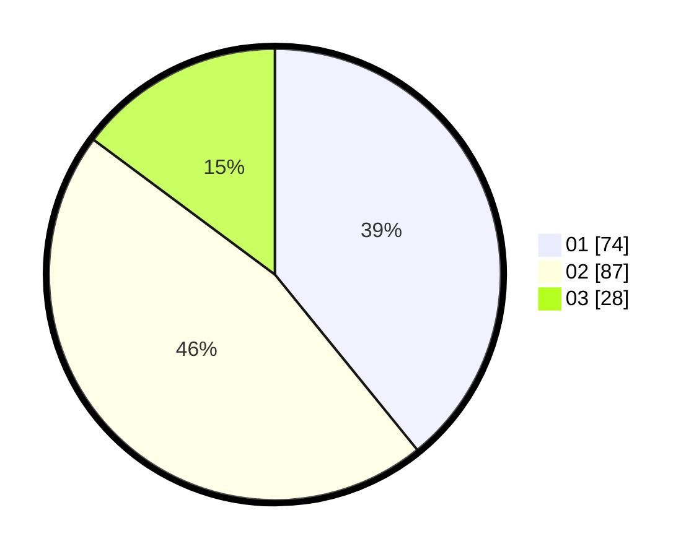

# Hasil

Hasil perolehan suara paslon dapat dilihat pada file paslon-01.txt, paslon-02.txt, dan paslon-03.txt.

Jika tidak ada, artinya data tersebut belum ada pada SIREKAP.

## Perolehan Suara

 * Paslon 01: **74**.
 * Paslon 02: **87**.
 * Paslon 03: **28**.

## Foto C Plano

https://sirekap-obj-formc.kpu.go.id/e683/pemilu/ppwp/31/75/07/10/04/3175071004242-20240214-200300--abce43a7-2404-4d7d-a6a9-7257ad059a5f.jpg

https://sirekap-obj-formc.kpu.go.id/e683/pemilu/ppwp/31/75/07/10/04/3175071004242-20240214-200325--5ec569b6-95e2-4938-9091-3dc87af3314e.jpg

https://sirekap-obj-formc.kpu.go.id/e683/pemilu/ppwp/31/75/07/10/04/3175071004242-20240214-200341--b6039f39-0eee-4699-9ed5-bfcd0d0dccc5.jpg

## DATA PEMILIH TETAP

Jumlah pemilih dalam DPT: **236**.
 * L: **116**.
 * P: **120**.

## DATA PENGGUNA HAK PILIH

Jumlah pengguna hak pilih dalam DPT: **191**.
 * L: **93**.
 * P: **98**.

Jumlah pengguna hak pilih dalam DPTb: **0**.
 * L: **0**.
 * P: **0**.

Jumlah pengguna hak pilih dalam DPK: **1**.
 * L: **1**.
 * P: **0**.

Jumlah pengguna hak pilih: **192**.
 * L: **94**.
 * P: **98**.

## JUMLAH SUARA SAH DAN TIDAK SAH

JUMLAH SELURUH SUARA SAH: **189**.

JUMLAH SUARA TIDAK SAH: **3**.

JUMLAH SELURUH SUARA SAH DAN SUARA TIDAK SAH: **192**.
